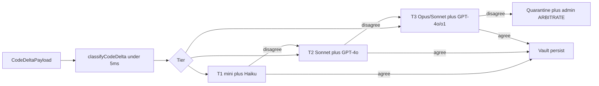

# MSGF Governance Engine — Pitfall Fixes + 3-Tier Dual CONVERGE Plan

**Status:** Implementation plan only (no execution code in this doc)  
**Scope:** MSGF core engine + Pulse Guard + `/admin/ops` (not Author/Education)  
**Companion:** [`integrations-setup.md`](./integrations-setup.md)

**Locked decisions (2026-07-23):**
- Sentry → Vault: **Quarantine immediately** + **HITL** on `/admin/ops` before demote-to-Hall or restore-to-Vault (immutable audit of human decision).
- Dual-key isolation: compound scope `company_id` + `project_origin` + `subpath_hash`.
- Signing/SSO work is **out of scope** here (see integrations plan).

---

## 0. Current anchors

| Concern | Path |
| :--- | :--- |
| Vault/Hall persist | [`lib/services/constraint-ledger.ts`](../../packages/msgf/lib/services/constraint-ledger.ts) |
| Metadata scope (`tenant_id`, `project_origin`, `company_id`) | [`lib/services/msgf-metadata-scope.ts`](../../packages/msgf/lib/services/msgf-metadata-scope.ts) |
| Vector table + RLS on `tenant_id` only | migrations `20260506200000_*`, `20260530150000_msgf_tenant_sovereign_rls.sql` |
| Index / match | [`lib/msgf-index.ts`](../../packages/msgf/lib/msgf-index.ts) |
| Logic drift (existing) | [`lib/services/logic-drift.ts`](../../packages/msgf/lib/services/logic-drift.ts) |
| CONVERGE / Pulse pipeline | [`lib/services/pulse-pipeline/`](../../packages/msgf/lib/services/pulse-pipeline/), consensus modules |
| Tenant BYOK keys | [`lib/services/tenant-provider-credentials.ts`](../../packages/msgf/lib/services/tenant-provider-credentials.ts) + CryptoService |
| Human arbitration | [`app/api/msgf/heal-queue/human-arbitration/route.ts`](../../packages/msgf/app/api/msgf/heal-queue/human-arbitration/route.ts), `heal-queue-service.ts` |
| Admin ops | [`app/admin/(authenticated)/ops/page.tsx`](../../packages/msgf/app/admin/(authenticated)/ops/page.tsx) |
| Sentry admin (list/resolve only) | [`lib/services/sentry-admin.ts`](../../packages/msgf/lib/services/sentry-admin.ts) |
| Verify ledger | [`lib/services/verify-result-ledger.ts`](../../packages/msgf/lib/services/verify-result-ledger.ts) |
| Pulse Guard Safe Build | [`packages/msgf-pulse-guard/src/utils/terminal-interceptor.ts`](../../packages/msgf-pulse-guard/src/utils/terminal-interceptor.ts) |
| Redis | Hot layer only — **no BullMQ** today |

**Note on user paths:** Spec referred to `/src/engine/*`. In this monorepo implement under:

`packages/msgf/lib/services/converge-tier/` (`classifier.ts`, `router.ts`, `converge-runner.ts`, `company-tier-overrides.ts`)

Tests: `packages/msgf/tests/converge-tier-*.test.ts` (not `__tests__/engine/` — match existing `tsx --test` layout).

---

## Part A — Structural pitfalls

### Task A1 — Quarantine column + retrieval filter (1 reviewable diff) — **DONE (code)**

**Applied:** `20260724020100_pillar_vectors_quarantine.sql`, `lib/services/vault-quarantine.ts`, wired into shadow / msgf-index / vault-lineage / context-loader / dev-event.  
**Ops still required:** apply migration on staging/prod.

**Change**
- Migration: add to `pillar_vectors` (+ sandbox mirror if needed):
  - `quarantine_status` TEXT CHECK IN (`NONE`,`QUARANTINED`,`DEMOTED_HALL`,`RESTORED`) DEFAULT `NONE`
  - `quarantine_reason` TEXT NULL
  - `quarantine_sentry_issue_id` TEXT NULL
  - `quarantine_at` TIMESTAMPTZ NULL
- Update Vault **read** paths (`msgf-index`, vault lineage, pulse CROSS-REF) to **exclude** `QUARANTINED` and `DEMOTED_HALL` from positive Vault retrieval.
- Keep rows physically present until HITL demote/restore.

**Verify**
- Unit: filter helper excludes quarantined.
- Integration: quarantined vault row not returned by match filter.

---

### Task A2 — Sentry crash webhook → match → quarantine (1 diff) — **DONE (code)**

**Applied:** `POST /api/msgf/ops/sentry-webhook`, `lib/services/sentry-vault-match.ts`, `lib/services/sentry-vault-quarantine.ts`.  
**Ops still required:** set `SENTRY_WEBHOOK_SECRET`; apply A1 quarantine migration if not already.

**Change**
- `POST /api/msgf/ops/sentry-webhook` (HMAC / shared secret `SENTRY_WEBHOOK_SECRET`).
- Parse issue/event; extract stack frames + release/commit if present.
- Matcher service `lib/services/sentry-vault-match.ts`:
  - Embed or lexical match stack + paths against Vault rows for `company_id` + `project_origin` (from release mapping table or project slug).
  - Confidence score; only quarantine if ≥ company threshold (default **0.75**, configurable).
- On match: set `quarantine_status=QUARANTINED`; enqueue ops alert package (reuse heal-queue / admin incidents shape).
- **Do not** auto-Hall.

**Verify**
- Unit: low confidence → no quarantine.
- Staging: mock webhook → row quarantined → CROSS-REF skips it.

---

### Task A3 — `/admin/ops` Quarantine review UI + HITL actions (1 diff) — **DONE (code)**

**Applied:** `AdminVaultQuarantinePanel`, `GET/POST /api/msgf/admin/vault-quarantine`, `vault-quarantine-hitl.ts` (demote → Hall + `DEMOTED_HALL`; restore → `RESTORED`).

**Change**
- Panel `AdminVaultQuarantinePanel.tsx` on ops page.
- Actions: `DEMOTE_TO_HALL` | `RESTORE_TO_VAULT` (COMPANY_ADMIN / GLOBAL_ADMIN only).
- On demote: ledger → Hall metadata; `quarantine_status=DEMOTED_HALL`; persist Hall row via existing `persistToHall`.
- On restore: `RESTORED` / `NONE`; clear reason; audit.

**Verify**
- Manual: demote then confirm retrieval uses Hall path / not Vault wins.
- AuthZ: developer 403.

---

### Task A4 — Dual-key tenant isolation (`company_id` + `project_origin` + `subpath_hash`) (1–2 diffs) — **DONE (code)**

**Applied:** `vector-scope-key.ts`, `withMsgfMetadataScope` stamps, `applyPillarVectorsCompoundScopeFilter` / post-read filter, ingest + msgf-index + vault-lineage wiring, migration `20260724030000_pillar_vectors_compound_scope.sql`, `docs/MSGF_TENANT_ISOLATION.md`.  
**Ops still required:** `npm run db:push` for the new index migration.

**Change**
1. Define `subpath_hash = sha256(normalize(file_path or dir_prefix))` truncated (16 hex) — helper in `lib/services/vector-scope-key.ts`.
2. Stamp on all Vault/Hall/ingest writes via `withMsgfMetadataScope` (extend).
3. Migration: generated columns or metadata-enforced checks; add composite index  
   `(metadata->>'company_id', metadata->>'project_origin', metadata->>'subpath_hash')`.
4. Strengthen RLS: extend `msgf_tenant_row_allowed` **or** add policy requiring:
   - service_role OR (
     - `tenant_id` match AND
     - `company_id` null OR matches JWT `company_id` claim / profile AND
     - optional project_origin allowlist from `msgf_user_projects`
   )
5. Refactor **app-layer** filters in `tenant-query-scope.ts` + `msgf-index.ts` to always pass compound filter when IDE sends `project_origin` + path.
6. **Do not** rewrite entire vector embedding algorithm — only filter/stamp.

**Verify**
- Negative test: tenant A cannot read tenant B vectors even with service-role-less authenticated client.
- Query with wrong `project_origin` returns empty.
- Perf smoke: index used (EXPLAIN on staging).

**Risk note:** service_role Pulse paths bypass RLS — keep **mandatory** app-layer compound filter on those paths (document as invariant in `docs/MSGF_TENANT_ISOLATION.md`).

---

### Task A5 — Async Pre-Flight in Pulse Guard + `--skip-msgf` audit (1–2 diffs)

**Change (extension `packages/msgf-pulse-guard`)**
1. Setting `msgf.asyncPreflight: true` (default on for Safe Build).
2. Safe Build / Run Scripts: **return local exit code immediately** to user terminal UX; fire-and-forget `verify-result` / `dev-event` with `async: true` + correlation id.
3. Status bar / Command Center: “MSGF shadow: pending | green | red”.
4. Emergency bypass: CLI flag or setting `msgf.skipMsgf=true` / run script env `MSGF_SKIP=1`:
   - Still POSTs `POST /api/msgf/ops/skip-audit` with payload `{ project_origin, user, git_sha?, reason, ts }`.
   - Server signs body with HMAC (`MSGF_SKIP_AUDIT_SECRET`) → append-only `msgf_skip_audit` table + ops feed.
   - **Never** silent skip without audit row.

**Verify**
- Local build finishes without waiting for network (latency test).
- Skip without secret rejected; with secret appears on `/admin/ops`.

---

### Task A6 — Unalterable signed JSON for ARBITRATE HITL (1 diff)

**Change**
- On `executeHealQueueHumanArbitration` and admin incident resolve: build canonical JSON snapshot (inputs, model opinions if present, operator id, action, timestamps, project_origin).
- Sign: `Ed25519` or HMAC-SHA256 with `MSGF_ARBITRATE_AUDIT_KEY`; store `msgf_arbitrate_audit` (`id`, `payload_json`, `signature`, `prev_hash` for hash-chain).
- Ops UI: download / verify signature endpoint `POST /api/msgf/admin/arbitrate-audit/verify`.

**Verify**
- Tamper payload → verify fails.
- Each HITL resolve creates exactly one audit row.

---

## Part B — 3-Tier Dual CONVERGE with dynamic model pairs

### Architecture

### Task B1 — Classifier (`classifyCodeDelta`) (1 diff)

**File:** `packages/msgf/lib/services/converge-tier/classifier.ts`

| Input | Output |
| :--- | :--- |
| diff lines add/mod/del, paths[], optional company overrides | `{ tier, riskScore, reasons[] }` |

Rules (pure heuristic, **&lt; 5ms**, zero LLM tokens):
- Diff weight normalized by lines.
- High-risk path regex: `/auth/`, `/security/`, `/db/`, `schema`, `/engine/`, `.env`, `middleware`.
- Low-risk: `\.md$`, `\.css$`, `/tests/`, lint/format-only heuristics.
- Map to TIER_1 (&lt;0.3), TIER_2 (0.3–0.7), TIER_3 (&gt;0.7) with path force-ups.

**Verify (unit)**
- Formatting/md → T1.
- `src/features/*` mid-size → T2.
- `/auth` or `/security` → T3 regardless of small diff.

---

### Task B2 — Company path override config (1 diff)

**File:** `company-tier-overrides.ts` + table `msgf_company_tier_rules`  
`(company_id, path_glob, force_tier, enabled)`

COMPANY_ADMIN CRUD API under `/api/msgf/workspace/tier-rules`.

**Verify:** rule “`/payment/**` → T3” forces Apex even if score low.

---

### Task B3 — Dynamic Dual CONVERGE runner (1–2 diffs)

**Files:** `converge-runner.ts`, wire into pulse-pipeline CONVERGE phase / heal consensus.

1. Accept `tier` from classifier (or Pulse metadata).
2. Resolve BYOK via existing encrypted credentials — **never log keys**; redact in errors.
3. Model pairs (config map, overridable by env):

| Tier | Model A | Model B |
| :--- | :--- | :--- |
| T1 | GPT-4o-mini | Claude Haiku (3.5/4) |
| T2 | Claude Sonnet | GPT-4o |
| T3 | Claude Sonnet or Opus | GPT-4o or o1 |

4. `Promise.allSettled` dual call; consensus compare (existing agreement score helpers).
5. Escalation: T1 disagree → rerun T2; T2 disagree → T3; T3 disagree → **auto-quarantine** matching Vault wins (`tier-quarantine.ts`) + Redis telemetry + Hall/HITL (A3 ops panel; no auto-Hall).
6. Agree → existing Vault persist path (**do not rewrite** vector lookup).

**Typed errors:** `Result<ConvergeOk, ConvergeErr>` style (or existing project Result pattern if present).

**Verify**
- Unit with mocked providers: T3 disagreement → HITL package + quarantine flag + Vault `QUARANTINED` update.
- BYOK: assert logs scrubber rejects `sk-` / `gsk-` patterns in converge logs (extend scrubber tests).
- Live Pulse: classifier `TIER_3` + model disagree → `tier_quarantine_applied` on response.

---

### Task B4 — Router facade + Pulse/IDE wiring (1 diff)

**File:** `router.ts` — `routeCodeDelta(payload) => classify → converge`.

Wire:
- Optional header `x-msgf-converge-tier` force (admin/debug).
- IDE Safe Build async path may call **classifier only** locally (port pure TS to extension or shared package) while cloud runs full converge.

**Verify:** end-to-end staging Pulse with small md change stays T1 (telemetry field on response).

---

### Task B5 — Unit test suite (1 diff)

**Files:** `tests/converge-tier-classifier.test.ts`, `tests/converge-tier-escalation.test.ts`

Cases from acceptance criteria:
- T1 formatting.
- T2 feature refactor paths.
- T3 security folder → Apex pair selection.
- Consensus failure escalation ladder.
- Classifier latency budget: assert synthetic 1k path scan &lt; 5ms on CI machine (soft assert / benchmark flag).

---

## Modular task checklist (1 task = 1 reviewable PR)

| ID | Title | Depends |
| :--- | :--- | :--- |
| A1 | Quarantine columns + retrieval exclude | — |
| A2 | Sentry webhook → match → quarantine | A1 |
| A3 | Ops HITL quarantine panel + audit actions | A1 |
| A4 | Compound vector scope + RLS/app filters | — |
| A5 | Async Pulse Guard + signed skip audit | done |
| A6 | Signed ARBITRATE audit chain | done |
| B1 | Classifier | done |
| B2 | Company tier overrides | done |
| B3 | Dynamic converge runner + escalation | done |
| B4 | Router + pipeline wiring | done |
| B5 | Unit tests | done |

---

## Acceptance criteria (roll-up)

1. Classifier &lt; 5ms heuristic; no LLM in classifier.
2. Quarantined Vault wins never used as positive CROSS-REF context until restore.
3. Sentry false-positive requires human before Hall demotion.
4. Compound key filters prevent cross-`project_origin` leakage on authenticated queries.
5. Async Safe Build does not block local exit code; skip always audited.
6. Every HITL resolve has verifiable signed JSON audit row.
7. T3 disagreement → quarantine + `/admin/ops` queue; keys never plaintext in logs.

---

## Explicit non-goals

- Rewriting `/src/vault/`-style embedding core (use existing `msgf-index` / constraint-ledger).
- Auto-delete vectors without HITL.
- BullMQ required for A/B unless shared with integrations I5 — may reuse same worker process.
- Author/Education product work.
