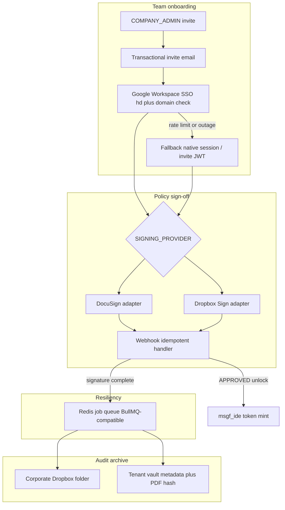

# MSGF Control Tower — Google Workspace + Dropbox Sign Integration Plan

**Status:** Implementation plan only (no execution code in this doc)  
**Hub:** `elphiesgatedai.elphiesyntax.com` (`packages/msgf`)  
**Roles:** `GLOBAL_ADMIN`, `COMPANY_ADMIN`, Developer  
**Keys:** `msgf_live_*` / `msgf_ide_*` scoped by tenant + `project_origin`  

**Locked decisions (2026-07-23):**
1. **Signing:** Feature-flagged **Dropbox Sign beside DocuSign** via `SigningProvider` abstraction (`SIGNING_PROVIDER` / company override).
2. **Google SSO:** **Google Workspace only** — enforce `hd` + `company_domains` allowlist; unmapped → `/invite-only`.
3. (Related engine work lives in [`fix-engine-pitfalls.md`](./fix-engine-pitfalls.md).)

---

## 0. Current codebase anchors (do not reinvent)

| Concern | Existing path |
| :--- | :--- |
| Email/password auth | [`app/_components/auth/AuthForm.tsx`](../../packages/msgf/app/_components/auth/AuthForm.tsx) |
| Auth callback (PKCE + GitHub token persist) | [`app/auth/callback/page.tsx`](../../packages/msgf/app/auth/callback/page.tsx) |
| Admin portal (launcher, not company CRUD) | [`app/admin/(authenticated)/portal/page.tsx`](../../packages/msgf/app/admin/(authenticated)/portal/page.tsx) |
| Company lazy-create + invites | [`lib/services/company-team.ts`](../../packages/msgf/lib/services/company-team.ts) |
| Invite API | [`app/api/msgf/workspace/team/invite/route.ts`](../../packages/msgf/app/api/msgf/workspace/team/invite/route.ts) |
| Tables | `msgf_companies`, `msgf_team_invites`, `msgf_invite_onboarding_bundles`, `msgf_docusign_envelopes`, `p4_profiles` — migration `20260629120000_company_team_vault_docusign.sql` |
| DocuSign JWT + Connect | [`lib/services/docusign-gateway.ts`](../../packages/msgf/lib/services/docusign-gateway.ts), [`app/api/msgf/ops/docusign-webhook/route.ts`](../../packages/msgf/app/api/msgf/ops/docusign-webhook/route.ts) |
| IDE mint (DocuSign gate today) | [`lib/services/ide-token-service.ts`](../../packages/msgf/lib/services/ide-token-service.ts), [`app/api/workspace/ide-tokens/route.ts`](../../packages/msgf/app/api/workspace/ide-tokens/route.ts) |
| Email | Supabase Auth SMTP only (no SendGrid SDK) — [`lib/email/branded-auth-email.ts`](../../packages/msgf/lib/email/branded-auth-email.ts) |
| Redis | Hot cache only — **no BullMQ yet** ([`lib/redis.ts`](../../packages/msgf/lib/redis.ts)) |

---

## 1. Target architecture



---

## Milestone I1 — Schema + domain allowlist (testable) — **DONE (code)**

**Applied in repo:** `20260724020000_company_domains_signing_provider.sql` + `lib/services/company-domains.ts`.  
**Ops still required:** run migration against staging/prod DB.

**Goal:** Postgres can express Workspace domains and signing provider preference without breaking DocuSign.

### Migration steps
1. New migration `packages/msgf/supabase/migrations/YYYYMMDDHHMMSS_company_domains_and_signing_provider.sql`:
   - `msgf_company_domains` (`id`, `company_id`, `domain` citext unique per company, `created_at`, RLS own-company)
   - `msgf_companies.signing_provider` TEXT CHECK IN (`docusign`,`dropbox_sign`) DEFAULT `docusign`
   - `msgf_companies.dropbox_archive_path` TEXT NULL (corporate folder path/id)
   - `msgf_team_invites.onboarding_status` TEXT CHECK IN (`PENDING_INVITE`,`PENDING_SIGNATURE`,`APPROVED`,`REJECTED`) DEFAULT `PENDING_INVITE` (backfill existing)
   - `msgf_signing_envelopes` provider-agnostic table OR extend `msgf_docusign_envelopes` with `provider`, `external_request_id`, `signed_pdf_sha256`, `dropbox_file_id` (prefer **extend** + rename view later to avoid dual tables)
2. Seed: allow COMPANY_ADMIN to CRUD domains via API (I2).

### Mock / fallback criteria
- Unit: domain normalize (`Foo.COM` → `foo.com`); reject `gmail.com` / `googlemail.com` as company domains.
- Migration applies cleanly on empty + existing invite rows.

### Verification
- `npm run db:push:verify -w msgf` (or project migrate path)
- RLS: authenticated user cannot read another company’s domains.

---

## Milestone I2 — SigningProvider abstraction + Dropbox Sign adapter (testable) — **DONE (code)**

**Applied:** `lib/services/signing/*`, invite path via `createSigningEnvelopeForInvite`, webhooks `signing-webhook` + `dropbox-sign-webhook`, mock-complete + `docs/MSGF_SIGNING.md`.  
**Ops still required:** configure Dropbox Sign / DocuSign secrets; apply I1 migration if not already.

**Goal:** Invites call an interface; DocuSign remains default; Dropbox Sign is selectable.

### Files to add/change
| Action | Path |
| :--- | :--- |
| Add | `lib/services/signing/SigningProvider.ts` — interface: `createEnvelope`, `getSigningUrl`, `parseWebhook`, `downloadSignedPdf` |
| Add | `lib/services/signing/DocuSignSigningProvider.ts` — wrap existing `docusign-gateway.ts` |
| Add | `lib/services/signing/DropboxSignSigningProvider.ts` — HelloSign/Dropbox Sign API |
| Add | `lib/services/signing/resolveSigningProvider.ts` — env `SIGNING_PROVIDER` overridden by `msgf_companies.signing_provider` |
| Change | `company-team.ts` invite path — call resolver instead of DocuSign only |
| Change | `ide-token-service` / ide-tokens route — gate on `onboarding_status === APPROVED` when enforce-sign |
| Add | `app/api/msgf/ops/signing-webhook/route.ts` — multi-provider entry **or** keep DocuSign route + add `dropbox-sign-webhook` |
| Add | Admin UI toggle on team settings (COMPANY_ADMIN) |

### Env (document in `.env.example` + `docs/MSGF_SIGNING.md`)
```
SIGNING_PROVIDER=docusign|dropbox_sign
DROPBOX_SIGN_API_KEY=
DROPBOX_SIGN_CLIENT_ID=
DROPBOX_SIGN_CLIENT_SECRET=   # if OAuth app
DROPBOX_SIGN_WEBHOOK_SECRET=
DROPBOX_ACCESS_TOKEN=         # archive folder (or refresh token flow)
DROPBOX_ARCHIVE_ROOT=/MSGF-Audit
# existing DOCUSIGN_* unchanged
```

### Webhook contract
- Event: Dropbox Sign `signature_request_all_signed` / `signature_request_signed` (normalize in adapter).
- Handler steps: verify HMAC → idempotency key `provider:request_id:event` → update invitee `onboarding_status=APPROVED` → enqueue archive job → do **not** block response > 2s.
- DocuSign Connect path remains; both write same envelope columns + `provider`.

### Mock API fallback
- `MSGF_SIGNING_MOCK=1` (extend `MSGF_DOCUSIGN_MOCK`): both providers return fake signing URL; mock-complete endpoint sets APPROVED (reuse pattern in `docusign/mock-complete`).

### Verification
- Unit: resolver picks company override over env.
- Integration mock: invite with `enforce_sign` → PENDING_SIGNATURE → mock webhook → APPROVED → IDE mint succeeds.
- Live DocuSign regression: existing Connect secret still verifies.

---

## Milestone I3 — Google Workspace SSO + invite-only gate (testable) — **DONE (code)**

**Applied:** `workspace-sso.ts`, `google-sso-circuit.ts`, AuthForm Workspace CTA, callback complete, `/invite-only`, domain CRUD API, `docs/MSGF_GOOGLE_WORKSPACE_SSO.md`.  
**Ops still required:** enable Google provider in Supabase; seed `msgf_company_domains`.


**Goal:** B2B SSO only; no open `@gmail.com` consumer login for company tenancy.

### Implementation steps
1. Enable Supabase Auth **Google** provider (ops runbook).
2. Client: `signInWithOAuth({ provider: 'google', options: { queryParams: { hd: '<primary_domain>', prompt: 'select_account' }, redirectTo: .../auth/callback?next=... } })` in `AuthForm` + admin sign-in (Workspace CTA).
3. Callback ([`auth/callback/page.tsx`](../../packages/msgf/app/auth/callback/page.tsx)):
   - After session: read `user.email` + identity `hd` / `hosted_domain` claim if present.
   - `POST /api/msgf/auth/workspace-sso-complete` (server):
     - Extract email domain.
     - Lookup `msgf_company_domains`.
     - If **no match** → clear/block session elevation; redirect `/invite-only?reason=domain_unmapped`.
     - If match → attach `p4_profiles.company_id`, allow `/admin/portal` or `/dashboard` based on role.
4. Invite mail: keep Supabase `inviteUserByEmail` initially; add optional SendGrid/Gmail API later behind `MSGF_TRANSACTIONAL_EMAIL=supabase|sendgrid` (phase I3b). For I3a, branded template copy: “Sign in with Google Workspace (@company.com)”.
5. **Native JWT / session fallback** when Google OAuth rate-limits or outage:
   - Detect OAuth error codes / circuit (`GOOGLE_SSO_CIRCUIT_OPEN` Redis key after N failures / 5m).
   - Fallback: email magic link or password path **only if** user already has `msgf_team_invites` row PENDING_* for that email (invite-gated), mint short-lived `msgf_invite_*` one-time token stored hashed (parallel to `msgf_ide_tokens` pattern in `ide-token-service.ts`).
   - Log fallback event to admin ops telemetry (no secrets).

### Files
| Add/Change | Path |
| :--- | :--- |
| Add | `app/invite-only/page.tsx` |
| Add | `app/api/msgf/auth/workspace-sso-complete/route.ts` |
| Add | `lib/services/company-domains.ts` |
| Add | `lib/services/google-sso-circuit.ts` |
| Change | `AuthForm.tsx`, admin `sign-in` |
| Change | callback page post-session branch |
| Docs | `docs/MSGF_GOOGLE_WORKSPACE_SSO.md` |

### Mock / fallback criteria
- Unit: `hd` missing + email `@allowed.com` still passes domain table check.
- Unit: `@gmail.com` always fails company domain attach.
- Circuit open → UI shows “Workspace SSO degraded — use invite magic link”.

### Verification
- Manual: Workspace user on allowlisted domain reaches portal.
- Manual: personal Gmail hits `/invite-only`.
- Probe: invitee without Google can complete via fallback when circuit forced open in staging.

---

## Milestone I4 — Dropbox archive of signed PDFs + green audit snapshots (testable) — **DONE (code)**

**Applied:** `lib/services/dropbox-archive.ts` (mock → `tmp/dropbox-archive/`, live Dropbox upload), worker wired, company `dropbox_archive_path` override.  
**Ops:** set `MSGF_DROPBOX_ARCHIVE_MOCK=1` or `DROPBOX_ACCESS_TOKEN`; drain via archive-worker.


**Goal:** On APPROVED signature (and optional green verify), store PDF + JSON snapshot under corporate Dropbox path.

### Steps
1. `lib/services/dropbox-archive.ts` — upload with path `` `${root}/${company_slug}/${yyyy}/${invite_id}/signed.pdf` `` + `audit.json`.
2. Queue consumer (see I5) calls archive after webhook.
3. Persist `dropbox_file_id`, `signed_pdf_sha256` on envelope row; write `msgf_tenant_vault_log` entry (existing audit table).
4. Optional: COMPANY_ADMIN configures `dropbox_archive_path` in team settings.

### Mock
- `MSGF_DROPBOX_ARCHIVE_MOCK=1` writes to local `tmp/dropbox-archive/` instead of API.

### Verification
- Mock webhook → files appear under mock root; DB ids set; IDE mint still unlocked.

---

## Milestone I5 — Resiliency: webhook idempotency + Redis job queue (testable) — **DONE (code)**

**Applied:** `msgf_webhook_inbox` + `archive_status`, `processSigningWebhookCompletion`, Redis list queue (`msgf-job-queue`), archive-worker stub, signing/DocuSign/Dropbox webhooks wired.  
**Ops:** `npm run db:push` for `20260724030100_webhook_inbox_archive_status.sql`. Live Dropbox upload remains I4.


**Goal:** Signing/archive/email failures must **not** block IDE Guard token minting once APPROVED is committed.

### Design (BullMQ-compatible on existing Redis)
1. Add dependency `bullmq` (or lightweight Redis list worker if BullMQ too heavy — **prefer BullMQ** for retries/backoff).
2. Queues: `signing-webhooks`, `dropbox-archive`, `invite-email`.
3. Table `msgf_webhook_inbox` (`idempotency_key` PK, `provider`, `payload`, `processed_at`, `error`).
4. Webhook handler: insert inbox ON CONFLICT DO NOTHING → enqueue → return 200.
5. Worker process: `packages/msgf/scripts/msgf-queue-worker.ts` + Cloud Run job / second service **or** process inline with `after()` + retry via Redis ZSET if single-service constraint (document ops choice).
6. IDE mint path: reads `onboarding_status` only; never awaits Dropbox upload.

### Fallback criteria
- If Redis down: webhook still updates APPROVED synchronously; archive marked `pending_local`; admin ops banner “archive backlog”.
- If Dropbox fails 5x: dead-letter + ops alert; user remains APPROVED.

### Verification
- Replay same webhook twice → single APPROVED transition; archive once.
- Kill Dropbox mock mid-job → IDE mint still works; job retries.

---

## Milestone I6 — Admin portal company UX (testable) — **DONE (code)**

**Applied:** `TeamReadinessPanel` on Setup → Manage Team, `GET/PATCH /api/msgf/workspace/team/readiness`, portal copy linking to checklist. MSGF-only (no Author/Education).


**Goal:** Align product copy with “invite → portal company” without pretending portal creates companies today.

### Steps
1. After first COMPANY_ADMIN Workspace SSO or invite accept, ensure `resolveOrCreateCompanyForAdmin` ran; redirect `/admin/portal` with checklist: domains, signing provider, archive path, map projects.
2. Portal card: “Team readiness” (domains count, signing mode, pending signatures).
3. Do **not** require Author/Education for this milestone (MSGF-only).

### Verification
- Fresh company admin completes checklist; developer invite reaches APPROVED and mints IDE token.

---

## Incremental test matrix (summary)

| Milestone | Automated | Manual / staging |
| :---: | :--- | :--- |
| I1 | Migration + domain unit | RLS smoke |
| A1 | Quarantine columns + Vault retrieval exclude | Unit: i1-a1-schema-helpers |
| I2 | Provider resolver + mock sign | DocuSign regression |
| I3 | Domain gate unit + circuit | Workspace hd login |
| I4 | Mock archive | Dropbox folder check |
| I5 | Idempotency + retry unit | Chaos Redis/Dropbox |
| I6 | — | Portal checklist UX |

---

## Explicit non-goals (this plan)

- Replacing DocuSign.
- Open Google consumer SSO.
- Author Ecosystem / Syntax Educates invite UX.
- Rewriting Vault vector search (see fix-engine plan).

---

## Suggested implementation order

I1 → I2 (mock) → I5 (queue skeleton) → I3 → I4 → I2 live Dropbox Sign → I6.
