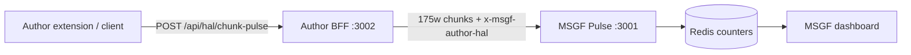

# Author Ecosystem ↔ MSGF wiring

Use Author as a **stress test** for the MSGF pipeline while watching **token savings** on the MSGF dashboard.

## Two tenant IDs (do not confuse them)

| ID | Example | Used for |
|----|---------|----------|
| **Author DB tenant** | UUID from `manuscript.tenant_id` | HAL routes (`/api/hal/chunk-pulse`, session) — validated as UUID |
| **MSGF contract tenant** | `author_ecosystem` | Pulse license, Redis counters, dashboard `?tenant_id=` |

The BFF always sends **`author_ecosystem`** (or `MSGF_AUTHOR_TENANT_ID`) on MSGF Pulse headers, even when the HAL body carries an Author UUID.

## Local ports

| App | Port |
|-----|------|
| LIFF / other project | **3000** (leave free) |
| **MSGF** (`npm run dev -w msgf`) | **3001** |
| Author BFF | 3002 |
| Author client | 5173 |

Set `MSGF_APP_URL=http://127.0.0.1:3001` on the Author BFF (and optional `MSGF_LOCAL_DEV_URL` in `packages/msgf/.env.local`).

## Platform test admin (GLOBAL_ADMIN)

One Supabase account can sign into MSGF admin, MSGF dashboard, and Author (same email/password).

```bash
npm run create:platform-admin -w msgf
# or: npm run create:platform-admin -w msgf -- --email=you@example.com --password='YourPass!'
```

The script sets `p4_profiles.msgf_access_role = GLOBAL_ADMIN`, auth metadata, Gated AI + Author entitlements, and bootstraps the `author_ecosystem` tenant brain.

Also add the email to `packages/msgf/.env.local`:

```env
MSGF_GLOBAL_ADMIN_EMAILS=you@example.com
```

Then sign in at `http://127.0.0.1:3001/admin/sign-in?next=/admin/portal`. On the **ops dashboard**, filter token savings with `?tenant_id=author_ecosystem` to see Author stress-test traffic (all Author users roll up under that MSGF tenant slug, not per-user tenant rows).

### Admin sign-in vs Author domain

| Task | URL |
|------|-----|
| MSGF operator / admin | **elphiesgatedai**.elphiesyntax.com `/admin/sign-in` |
| Author product login | **authorecosystem**.elphiesyntax.com `/sign-in` |

Email confirmation must finish on MSGF’s `/auth/callback` (session cookies for admin live on the Gated AI host). If Supabase **Site URL** is set to Author, the Author client now forwards `/auth/callback` → MSGF.

**Supabase Dashboard → Authentication → URL configuration**

- Site URL: `https://elphiesgatedai.elphiesyntax.com` (recommended for admin)
- Additional redirect URLs: include both  
  `https://elphiesgatedai.elphiesyntax.com/auth/callback` and  
  `https://authorecosystem.elphiesyntax.com/auth/callback`  
  (plus local `http://127.0.0.1:3001/auth/callback` and `http://127.0.0.1:5173/auth/callback`)

**Production cookies:** set `MSGF_AUTH_COOKIE_DOMAIN=.elphiesyntax.com` on MSGF Cloud Run so a session started on either subdomain is visible on both (optional; admin still requires operator role).

## Docker (easiest local stack)

```bash
npm run docker:preflight   # checks packages/msgf/.env.local
npm run docker:dev         # Redis + Author + MSGF
```

See [DOCKER_LOCAL_DEV.md](./DOCKER_LOCAL_DEV.md).

## Author register / login (`fetch failed`)

The Vite client calls **`/api/auth/register`** on the **Author BFF** (port **3002**). `Failed to fetch` in the browser usually means the BFF is not running.

```bash
npm run dev:author
# or two terminals: npm run dev:author-bff  +  npm run dev:author-client
npm run verify:bff-env --prefix apps/author-ecosystem/server
```

Keep real Supabase keys in **`packages/msgf/.env.local`** only:

- `NEXT_PUBLIC_SUPABASE_PUBLISHABLE_KEY` (publishable / `sb_publishable_...`)
- `SUPABASE_SERVICE_ROLE_KEY` (secret / `sb_secret_...`)

A separate **JWT Secret** is **not required** on new Supabase projects — the BFF validates sessions via the Auth API and SSR cookies. Optional `SUPABASE_JWT_SECRET` only enables local HS256 Bearer verify (legacy dashboard).

Registration requires typing the Vault Pact attestation exactly: **`I SIGN THE VAULT PACT`**.

## One-time setup

1. Shared Supabase keys live in `packages/msgf/.env.local` (see `apps/author-ecosystem/server/.env.example` for MSGF bridge vars only).

2. Mint the Author pulse license:

   ```bash
   npm run bootstrap:author-msgf -w msgf
   ```

   Paste the printed key into `MSGF_AUTHOR_PULSE_LICENSE_KEY`.

3. Enable dev-session counting for local stress tests:

   ```env
   MSGF_AUTHOR_DEV_SESSION=1
   ```

4. Verify BFF env:

   ```bash
   npm run verify:bff-env --prefix apps/author-ecosystem/server
   ```

## Run the stack

```bash
npm run dev -w msgf                    # http://127.0.0.1:3001 (3000 free for LIFF / other apps)
npm run dev --prefix apps/author-ecosystem/server   # http://127.0.0.1:3002
```

Optional: Author client + VS Code extension for real HAL chunk flushes.

```bash
npm run dev:author-client   # http://localhost:5173 (also http://127.0.0.1:5173 after host: true)
```

If the UI loads but sign-in fails, confirm `NEXT_PUBLIC_SUPABASE_URL` and `NEXT_PUBLIC_SUPABASE_PUBLISHABLE_KEY` exist in `packages/msgf/.env.local` (Vite reads them automatically).

## Observe token savings (MSGF)

After traffic flows, open (from `GET /api/status` → `msgf_mapping.dashboard_links`):

- **Token savings:** `/dashboard#token-savings?tenant_id=author_ecosystem`
- **Pulse routing:** `/dashboard?tenant_id=author_ecosystem#pulse-routing`

The extension **Open dashboard** action prefers these MSGF URLs when the BFF reports `dashboard_links.token_savings`.

## Stress test probes

```bash
# Mapping + optional pulse (set AUTHOR_ECOSYSTEM_JWT = Supabase access token)
npm run probe:author-ecosystem -w msgf

# Full chunk-pulse path (needs Author tenant UUID from a manuscript)
AUTHOR_STRESS_TENANT_UUID=<uuid> AUTHOR_ECOSYSTEM_JWT=<jwt> npm run probe:author-ecosystem -w msgf

# Savings report (offline or live)
npm run track:author-tokens -w msgf
npm run track:author-tokens:live -w msgf
```

## Data path



Headers on each pulse:

- `x-msgf-project-origin: elphiesyntax/author-ecosystem`
- `x-msgf-tenant-id: author_ecosystem`
- `x-msgf-entity-id: <signed-in user UUID>`
- `x-msgf-dev-session: 1` when `MSGF_AUTHOR_DEV_SESSION=1`

## Troubleshooting “connection failed”

| Symptom | Cause | Fix |
|---------|--------|-----|
| Browser can’t open `localhost:3001` | MSGF not running | `npm run dev -w msgf` (wait for **Ready**) |
| Browser opens `3000` but not MSGF | LIFF / other app owns **3000** | Use **http://127.0.0.1:3001** for MSGF |
| Author UI / extension can’t reach API | BFF not on **3002** | `npm run dev:author-bff` |
| BFF exits immediately | Missing **`SUPABASE_JWT_SECRET`** | Supabase Dashboard → **Settings → API → JWT Secret** → add to `packages/msgf/.env.local` (not only `apps/author-ecosystem/server/.env`) |
| `msgf_mapping.ready: false` | No pulse license | `npm run bootstrap:author-msgf -w msgf` → set `MSGF_AUTHOR_PULSE_LICENSE_KEY` |

Quick checks:

```bash
curl http://127.0.0.1:3001/          # MSGF (should return HTML, not connection refused)
curl http://127.0.0.1:3002/api/ping  # Author BFF → {"pong":true}
```

## Related docs

- [`docs/MONOREPO_PRODUCTS.md`](MONOREPO_PRODUCTS.md) — workspace preset `author_ecosystem`
- [`docs/MSGF_BRAIN_ROUTING.md`](MSGF_BRAIN_ROUTING.md) — Small Brain savings
- [`docs/MSGF_RC_CHECKLIST.md`](MSGF_RC_CHECKLIST.md) — RC gates
