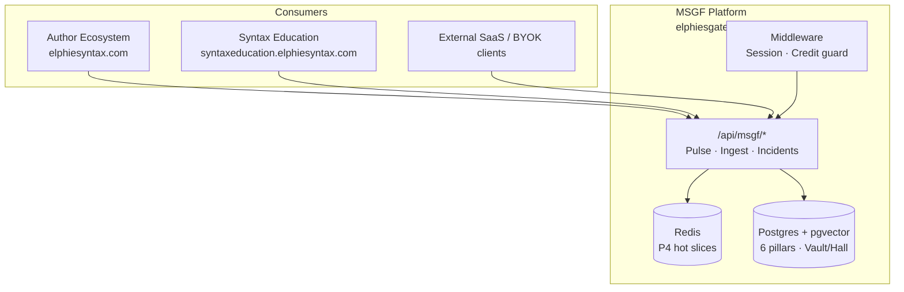

# MSGF 1.0 — Vision & Release Plan (SSoT)

**Status:** Single source of truth for **MSGF 1.0** — the first production release of the Modular State-Gate Framework as both **platform** and **shared engine**.

**Sources (canonical order):**

1. **MSGF V3.2-ULTRA Performance Spec** — [`docs/references/MSGF_v3_2_masterdoc.pdf`](./references/MSGF_v3_2_masterdoc.pdf) (Elphie Syntax LLC © 2026) — **primary architecture for 1.0**
2. MSGF V3.0 Comprehensive Master Specification — `MSGF_v3_masterdoc.pdf` (historical; six-pillar baseline; superseded on hot/cold storage and master directive)
3. Repo execution audit — [`packages/msgf/pre_ingestion_audit.md`](../packages/msgf/pre_ingestion_audit.md) (SWEEP / CONVERGE backlog)
4. Monorepo product surfaces — [`MONOREPO_PRODUCTS.md`](./MONOREPO_PRODUCTS.md)

**Companion:** Author-facing product remains [`AUTHOR_ECOSYSTEM_ROADMAP.md`](./AUTHOR_ECOSYSTEM_ROADMAP.md). Pillar/AUTH implementation status: [`PILLAR_PROGRESS.md`](./PILLAR_PROGRESS.md).

**Production URL (MSGF):** **https://elphiesgatedai.elphiesyntax.com**

**Last updated:** 2026-05-15 (V3.2-ULTRA integrated)

---

## 1. Vision statement (1.0)

MSGF 1.0 implements **MSGF V3.2-ULTRA**: a **stateful logic architecture** with **hot/cold storage**, **Vault vs Hall** differential learning, and the **V3.2-ULTRA master directive** (SWEEP → SHARD → DEFEND → CROSS-REF → CONVERGE → ARBITRATE → PERSIST).

MSGF 1.0 delivers a **stateful, self-defending AI orchestration layer** that any application can adopt:

- **For Elphie Syntax products:** MSGF is the **brain** behind [Author Ecosystem](https://elphiesyntax.com) (HAL, Vault/Hall, Pulse, revision gates) and [Syntax Education](https://syntaxeducation.elphiesyntax.com) (policy-isolated tenant).
- **For the market:** MSGF at **elphiesgatedai.elphiesyntax.com** is a **standalone gated-AI product** — subscribe, send keystroke/logic deltas through Pulse, ingest knowledge into pillars, and receive tiered audits without running your own consensus stack.

Design principle: **six isolated pillars** (V3.0 lineage), **1.1.1 genealogical bug index**, **Redis hot + Postgres cold** (V3.2), **shadow preflight + Vault/Hall cross-ref**, **dual-model consensus**, and **mandatory human tie-breaker** on RED disagreement or retry exhaustion — not a generic chat wrapper.

---

## 2. Architecture (MSGF V3.2-ULTRA + six-pillar core)

### 2.0 High-speed storage & sharding (V3.2)

| Layer | Technology | Role | 1.0 target |
| :--- | :--- | :--- | :--- |
| **Hot layer** | **Redis** | P4 State Ledger **active slices** — nanosecond gate validation for the current logic gate | **Partial** — `lib/msgf-hot-layer.ts` + active-slice TTL; production Redis required for ULTRA SLA |
| **Cold layer** | **Postgres** (Supabase) | Long-term **6-pillar** archive; **pgvector** (1536-dim) for semantic retrieval and **1.1.1** lineage | **Required** — migrations + `pillar_vectors` + `p4_state_ledger` |

**1.0 rule:** Cold layer must be production-ready; hot layer must be **wired for Pulse active slices** (env: Redis URL). Full “nanosecond” SLO and hot-primary reads are **1.1** polish unless infra is ready at RC.

### 2.1 Six-pillar data architecture (V3.0 core, V3.2 cold mapping)

Data and logic are segmented to reduce noise, isolate context, and optimize token use.

| Pillar | Master spec role | Repo mapping (indicative) |
| :--- | :--- | :--- |
| **P1 — Static Ledger** | Immutable laws; violations **HALT** | `lib/msgf-legal.ts`, `msgf-init.js`, security migrations, Prancer CI |
| **P2 — Flow Sequence** | Build priority & dependency logic | Pulse orchestration, `pre_ingestion_audit.md` CONVERGE plan, deployment order |
| **P3 — Entity Profiles** | Roles, tiers, multi-tenant safety | Supabase auth, `p4_profiles`, `msgf_legacy_tiers`, Stripe entitlements (1.0) |
| **P4 — State Ledger** | Flight recorder; **hot active slices** (Redis) + cold beats | `p4_state_ledger`, `state_beats`, `lib/msgf-hot-layer.ts`, `p4_hal_ledger` |
| **P5 — Local Variables** | Site/module sharded context | Per-tenant UI config, `tenant-manifest.json`, dashboard shells |
| **P6 — Constraint Ledger** | **Vault** (positive) vs **Hall** (negative) | `msgf-shadow.ts`, `msgf-index.ts`, `pillar_vectors`, Hall purge (30d LOW) |

Pillar charters for AI/dev: `packages/msgf/.msgf/P1_HAL.md` … `P6_RAG.md` (authoring domain); engineering rules: `packages/msgf/.cursorrules`.

### 2.2 Genealogical bug index (1.1.1 — V3.2)

Hierarchical tree for **lineage scans** and efficient cross-reference of fixes (not flat logs).

| Level | Meaning | Example |
| :--- | :--- | :--- |
| **1.0** | Category — major module | `1.0_AUTH`, `1.0_UI`, `1.0_API` |
| **1.1** | Branch — sub-logic or LOM gate | `1.1_BYOK_HANDSHAKE` |
| **1.1.1** | Instance — discrete **Fix Delta** + P4 snapshot at failure | Row in `p4_state_ledger` + metadata |

Repo: `pre_ingestion_audit.md` §2 sharding map; Hall seed labels; `tests/test-lom-disagreement.ts` (P6 lineage `MSGF_V3_STRICT.constraint_ledger.1.1.1`).

### 2.3 The Vault vs the Hall of Hallucinations (V3.2)

| Index | Stores | AI use |
| :--- | :--- | :--- |
| **The Vault** (positive) | Successful **1.1.1** fix deltas | Repeat **what worked** |
| **The Hall** (negative) | Failed shadow attempts, rejected consensus | Avoid **what failed** |

**Automatic purge (V3.2):** Hall entries at non-critical **LOW** tier age out after **30 days** to keep vector search fast — implement via `scripts/msgf-tier-processor.js` purge path + policy flags on `pillar_vectors` metadata.

**Repo:** `lib/msgf-shadow.ts` (pre-flight), `lib/msgf-index.ts` (lineage), ingest → Vault; Pulse RED → Hall short-circuit.

### 2.4 Tiered batching & human tie-breaker (V3.2)

| Tier | Frequency | Action protocol |
| :--- | :--- | :--- |
| **RED (Critical)** | Immediate | Claude/Gemini consensus + shadow mode; **human tie-breaker mandatory on disagreement** |
| **YELLOW (Med)** | Every **6 hours** | Batched calibration summary (`scripts/msgf-tier-processor.js`) |
| **GREEN (Low)** | Every **24 hours** | Cumulative style + token efficiency reports |

### 2.5 Defensive protocols (1.0 must ship)

Maps V3.0 defensive ideas to V3.2 **DEFEND** / **CROSS-REF** steps:

1. **SWEEP** — Day-zero scan → [`pre_ingestion_audit.md`](../packages/msgf/pre_ingestion_audit.md).
2. **Shadow mode** — Silent dry-run before injection; abort on P1/P6 or P2 impact (`lib/msgf-shadow.ts`).
3. **CROSS-REF** — Pre-flight compares proposed deltas against **Vault + Hall** (`preFlightCheck`, `getLogicLineage`).
4. **CONVERGE** — Dual-model consensus (`msgf-consensus.ts`, Pulse).
5. **ARBITRATE** — HITL on consensus failure **or** retry **> 3** → `ERR_RECURSION_LIMIT` (`tests/test-lom-disagreement.ts`).
6. **PERSIST** — Approved deltas to Vault; discard redundant hot state per retention policy.

### 2.6 V3.2-ULTRA master directive → 1.0 acceptance criteria

| # | V3.2-ULTRA step | 1.0 done when |
| :---: | :--- | :--- |
| 1 | **SWEEP** — Day-zero scan; export/maintain `pre_ingestion_audit.md` | Audit current; CONVERGE backlog tracked |
| 2 | **SHARD** — Active gates in **Redis** (hot); 6 pillars in **Postgres** (cold) + pgvector 1.1.1 | Migrations live; Redis connected for hot slices; ingest → `pillar_vectors` |
| 3 | **DEFEND** — Shadow mode + LOM gates on all operations | Pulse + ingest gated; LOM test in staging |
| 4 | **CROSS-REF** — Pre-flight Vault + Hall before consensus | `preFlightCheck` on Pulse path; no bypass in prod |
| 5 | **CONVERGE** — Claude/Gemini consensus on RED / critical deltas | Pulse consensus path green in smoke tests |
| 6 | **ARBITRATE** — HITL if consensus fails or retry **> 3** | Dashboard tie-breaker + `ERR_RECURSION_LIMIT` surfaced |
| 7 | **PERSIST** — Success → Vault; trim hot / Hall LOW 30d purge | Vault writes audited; tier processor + purge job scheduled |

*V3.0-STRICT (7 steps) is superseded by this table; same intent, V3.2 naming.*

---

## 3. Dual product model

| Mode | Description | 1.0 requirement |
| :--- | :--- | :--- |
| **Embedded engine** | Author/Education BFFs call MSGF APIs with shared or federated auth | Documented integration; probe script green |
| **Standalone SaaS** | Customers sign up on gatedai; Pulse + dashboard + billing | Marketing/checkout shell + Stripe entitlements |
| **BYOK / multi-software** | Third parties use API keys + tenant IDs (`lib/api-key-tenant.ts`) | Tenant manifest + silo enforcement; public API docs |

---

## 4. Release scope — MSGF 1.0

### 4.1 In scope (1.0)

| Area | Deliverable |
| :--- | :--- |
| **Runtime** | Production Next app on **elphiesgatedai.elphiesyntax.com** (`packages/msgf`) |
| **Core APIs** | `POST /api/msgf/pulse`, `POST /api/msgf/ingest`, incidents, ecosystem bridge |
| **Gates** | Auth, legal pledge (`state_beats`), biometric baseline, shadow RED block, Vault/Hall CROSS-REF, credit guard |
| **Storage (V3.2)** | Cold: Supabase/pgvector; Hot: Redis active slices on Pulse path |
| **Data** | Supabase migrations applied; `verify:supabase-schema` in CI |
| **Ops UI** | `apps/msgf-dashboard` wired to real alerts (not mocks) for RED/HITL |
| **Public shell** | `packages/msgf/apps/web` — marketing, pricing, Stripe Checkout return URLs |
| **Billing** | Stripe Checkout + webhook → `p4_profiles` / P3 tier + update credits (see §5) |
| **Security** | `security:prancer-pillars` on PR; service account + secrets documented |
| **Author integration** | Author BFF documented path to Pulse/ingest; shared cookie domain option |

### 4.2 Out of scope (post–1.0)

| Item | Target |
| :--- | :--- |
| Full Pulse route refactor (modular SWEEP→PERSIST handlers) | 1.1 |
| Hot-layer **primary read path** at nanosecond SLO (Redis-first for all gates) | 1.1 |
| Automated Hall LOW-tier 30d purge in production cron (if not done in 1.0 RC) | 1.0 RC or 1.1 |
| Prancer Cloud policy packs | 1.1+ |
| Complete lore-bot matrix (Author AUTH-25) | Author 1.x |
| Education platform feature-complete | Education 1.0 track |

### 4.3 Hybrid license (P3 — from engineering rules)

Aligned with `packages/msgf/.cursorrules`:

| Customer type | Gate |
| :--- | :--- |
| **Monthly** | `Stripe_Status == active` |
| **Lifetime** | `Update_Credits > 0` |
| **Metering** | Each consensus / self-heal decrements P3 credits |
| **RED disagreement** | HITL tie-breaker via dashboard |

*1.0 ships schema + webhook + middleware hooks; exact credit SKUs are product ops configuration.*

---

## 5. Milestones toward 1.0

| Milestone | Theme | Key work | Roadmap § |
| :---: | :--- | :--- | :--- |
| **M0** | Platform truth | This doc + [`MONOREPO_PRODUCTS.md`](./MONOREPO_PRODUCTS.md); root `.env.example` MSGF block; `npm run verify:msgf-env -w msgf`; Phase 0 smoke in [`packages/msgf/README.md`](../packages/msgf/README.md) | — |
| **M1** | Engine hardening (V3.2) | SHARD hot/cold wiring; split Pulse into SWEEP→PERSIST handlers; Zod metadata; ARBITRATE/recursion in CI | §2.6 |
| **M2** | Standalone surface | Implement `packages/msgf/apps/web` (pricing, docs, signup); deploy to gatedai subdomain | 1.0 §4.1 |
| **M3** | Commercial gates | Checkout API, webhook → tier/credits, entitlement middleware after credit guard | P3, `.cursorrules` |
| **M4** | Multi-tenant ops | Dashboard live data; RED→HITL; YELLOW 6h / GREEN 24h cron; Hall 30d purge; Jira for RED | §2.4 |
| **M5** | Ecosystem wiring | Author + Education smoke: register → pledge → Pulse; cross-domain cookies | [`MONOREPO_PRODUCTS.md`](./MONOREPO_PRODUCTS.md) |
| **M6** | 1.0 RC | V3.2-ULTRA checklist §2.6 all green in staging; load test Pulse; Prancer; runbook | §2.6 |

**Suggested gate for tag `msgf-v1.0.0`:** M1–M5 complete in staging; M6 sign-off.

---

## 6. Repo map (engineering)

| Concern | Path |
| :--- | :--- |
| Next runtime | `packages/msgf/` |
| Pulse | `packages/msgf/app/api/msgf/pulse/route.ts` |
| Ingest | `packages/msgf/app/api/msgf/ingest/route.ts` |
| Credit guard | `packages/msgf/lib/creditGuard.ts`, `middleware.ts` |
| Stripe (skeleton) | `packages/msgf/app/api/webhooks/stripe/route.ts`, `src/lib/stripe.ts` |
| Pre-ingestion audit (SWEEP) | `packages/msgf/pre_ingestion_audit.md` |
| Hot layer (P4 slices) | `packages/msgf/lib/msgf-hot-layer.ts` |
| Shadow / CROSS-REF | `packages/msgf/lib/msgf-shadow.ts`, `lib/msgf-index.ts` |
| Tier batch + Hall purge | `packages/msgf/scripts/msgf-tier-processor.js` |
| V3.2 PDF (repo copy) | `docs/references/MSGF_v3_2_masterdoc.pdf` |
| Admin dashboard | `apps/msgf-dashboard/` |
| Future public web | `packages/msgf/apps/web/` |
| Shared core | `packages/core/`, `packages/msgf/packages/core/` |
| Migrations | `packages/msgf/supabase/migrations/` |
| Tenant silos | `packages/msgf/config/tenant-manifest.json` |

---

## 7. Current readiness (honest snapshot)

*As of 2026-05-15 — update when milestones close.*

| Capability | Status |
| :--- | :--- |
| **V3.2-ULTRA §2.6** (7 steps) | **~55%** — see row-by-row below |
| SWEEP (`pre_ingestion_audit.md`) | **Done** (analysis); CONVERGE not done |
| SHARD — cold (Postgres/pgvector) | **Partial → strong** |
| SHARD — hot (Redis active slices) | **Partial** — module exists; prod Redis + Pulse path TBD |
| DEFEND — shadow + LOM | **Partial** — Pulse; LOM test harness |
| CROSS-REF — Vault/Hall preflight | **Partial** — `msgf-shadow`; metadata contracts weak |
| CONVERGE — dual-model consensus | **Partial** — Pulse monolith |
| ARBITRATE — HITL / retry > 3 | **Partial** — logic exists; dashboard mock |
| PERSIST — Vault writes + Hall purge | **Partial** — purge script path; 30d policy verify |
| Stripe billing | **Early** — webhook logs only |
| Public gatedai site | **Not started** |
| Author ↔ Pulse integration | **Partial** — shared DB; HAL does not call Pulse |

---

## 8. Environment & domains (1.0 checklist)

| Variable / config | Purpose |
| :--- | :--- |
| `NEXT_PUBLIC_SUPABASE_URL`, keys | Auth + data plane |
| `GOOGLE_APPLICATION_CREDENTIALS` / `service-account.json` | Vertex / Pulse |
| `STRIPE_SECRET_KEY`, `STRIPE_WEBHOOK_SECRET`, Price IDs | Billing |
| `MSGF_AUTH_COOKIE_DOMAIN` | Cross-subdomain session with Author |
| `MSGF_BILLING_SOFT_CAP_USD`, `MSGF_CREDIT_GUARD_DISABLED` | Ops caps |
| `MSGF_ENABLE_LOM_TEST` | Staging LOM harness |
| `REDIS_URL` (or project Redis env) | V3.2 hot layer — P4 active slices |

**DNS (production):**

- `elphiesyntax.com` → Author Ecosystem
- `elphiesgatedai.elphiesyntax.com` → MSGF Next + web shell
- `syntaxeducation.elphiesyntax.com` → Syntax Education

---

## 9. Relationship to Author 1.0

| Author SSOT feature | MSGF 1.0 responsibility |
| :--- | :--- |
| HAL Ledger | Pulse + `p4_hal_ledger`; P1 standard (`universal/p1-hal-standard`) |
| Vault Seal | Legal pledge + Vault/Hall; shared `legal_attestations` |
| Cool Down / Bicameral audit | Author BFF revision gate; MSGF models for consensus where invoked |
| Publisher encryption levels | `PublisherGrantService` + MSGF verify-badge route |

Author releases should not duplicate MSGF guardrails — they **call** MSGF and enforce product UX (manuscripts, tiers, locks).

---

## Changelog (SSoT only)

| Date | Change |
| :--- | :--- |
| 2026-05-15 | **V3.2-ULTRA integrated:** Primary spec `docs/references/MSGF_v3_2_masterdoc.pdf`; hot/cold layers; Vault vs Hall + 30d purge; tiered batching + mandatory RED tie-breaker; V3.2-ULTRA directive (SWEEP→PERSIST) replaces V3.0-STRICT table; readiness mapped to §2.6. |
| 2026-05-15 | Initial MSGF 1.0 SSOT from `MSGF_v3_masterdoc.pdf`: vision, dual product model, six pillars, milestones M0–M6, three-domain monorepo alignment. |
