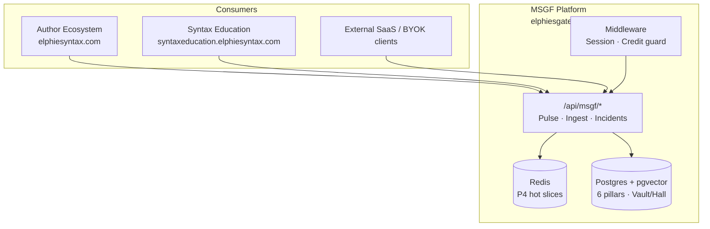

# MSGF 1.0 — Vision & Release Plan (SSoT)

**Status:** Single source of truth for **MSGF 1.0** — the first production release of the Modular State-Gate Framework as both **platform** and **shared engine**.

**Sources (canonical order):**

1. **MSGF V3.2-ULTRA Performance Spec** — [`docs/references/MSGF_v3_2_masterdoc.pdf`](../references/MSGF_v3_2_masterdoc.pdf) (Elphie Syntax LLC © 2026) — **primary architecture for 1.0**
2. MSGF V3.0 Comprehensive Master Specification — `MSGF_v3_masterdoc.pdf` (historical; six-pillar baseline; superseded on hot/cold storage and master directive)
3. Repo execution audit — [`packages/msgf/pre_ingestion_audit.md`](../../packages/msgf/pre_ingestion_audit.md) (SWEEP / CONVERGE backlog)
4. Monorepo product surfaces — [`MONOREPO_PRODUCTS.md`](../MONOREPO_PRODUCTS.md)

**Companion:** Author-facing product remains [`AUTHOR_ECOSYSTEM_ROADMAP.md`](../author-ecosystem/AUTHOR_ECOSYSTEM_ROADMAP.md). Pillar/AUTH implementation status: [`PILLAR_PROGRESS.md`](../PILLAR_PROGRESS.md).

**Production URL (MSGF):** **https://elphiesgatedai.elphiesyntax.com**

**Last updated:** 2026-09-18 (P7 closed loop + Shadow apply-on-activate; Global Brain zero-text swarm telemetry; remaining = Sept 18 schema apply + staging smoke + Checkout smoke + mock-off)

**Picker status (public):** **Beta testing** — console seats invite-only; free 7-day Shadow Proxy at `/shadow-trial` (clock starts on first call; then 3-day Individual Pro full access). Pricing SSOT: **$0** Indie · **$99** Pro · **$49**/user/mo Startup Team (`pricing-tiers.ts`).

**Product capabilities (non-engineering):** [`MSGF_PRODUCT_OVERVIEW.md`](./marketing/MSGF_PRODUCT_OVERVIEW.md) — product map, full features, sales angles, **launch readiness %**. Ops panel map: [`MSGF_ADMIN_HUB.md`](./technical-specs/MSGF_ADMIN_HUB.md).

**Testing & deploy:** [`MSGF_TESTING.md`](./technical-specs/MSGF_TESTING.md) · **Brain routing:** [`MSGF_BRAIN_ROUTING.md`](./technical-specs/MSGF_BRAIN_ROUTING.md) · **Global Brain telemetry:** [`MSGF_GLOBAL_BRAIN_TELEMETRY.md`](./technical-specs/MSGF_GLOBAL_BRAIN_TELEMETRY.md) · **Solo integrators:** [`MSGF_SOLO_INTEGRATION.md`](../integrations/technical-specs/MSGF_SOLO_INTEGRATION.md) · **Buyer SaaS:** [`MSGF_BUYER_WALKTHROUGH.md`](./marketing/MSGF_BUYER_WALKTHROUGH.md) · `npm run deep-test:solo` · `npm run bootstrap:solo -w msgf` · `npm run create:buyer-user -w msgf`

**Dev TODO (production-first):** [`MSGF_DEV_TODO.md`](./MSGF_DEV_TODO.md)  
**RC gate:** [`MSGF_RC_CHECKLIST.md`](./MSGF_RC_CHECKLIST.md) · **Deploy:** [`MSGF_DEPLOY_CHECKLIST.md`](./MSGF_DEPLOY_CHECKLIST.md)  
**Boss demo (parked):** [`MSGF_BOSS_DEMO_RUNBOOK.md`](./marketing/MSGF_BOSS_DEMO_RUNBOOK.md)  
**Tenant isolation (A4):** [`MSGF_TENANT_ISOLATION.md`](./technical-specs/MSGF_TENANT_ISOLATION.md)  
**CONVERGE tiers (Part B):** [`MSGF_CONVERGE_TIER.md`](./technical-specs/MSGF_CONVERGE_TIER.md) · **TRI brains:** [`MSGF_BRAIN_ROUTING.md`](./technical-specs/MSGF_BRAIN_ROUTING.md)  
**Integrations:** [`MSGF_GITHUB_PROJECTS.md`](../integrations/technical-specs/MSGF_GITHUB_PROJECTS.md) · [`MSGF_SENTRY.md`](../integrations/technical-specs/MSGF_SENTRY.md) · [`MSGF_SIGNING.md`](../integrations/technical-specs/MSGF_SIGNING.md) · [`MSGF_GOOGLE_WORKSPACE_SSO.md`](../integrations/technical-specs/MSGF_GOOGLE_WORKSPACE_SSO.md) · [`MSGF_PQC_CRYPTO_AUDIT.md`](./technical-specs/MSGF_PQC_CRYPTO_AUDIT.md) · [`MSGF_SHADOW_PROXY.md`](./technical-specs/MSGF_SHADOW_PROXY.md) · [`MSGF_GLOBAL_BRAIN_TELEMETRY.md`](./technical-specs/MSGF_GLOBAL_BRAIN_TELEMETRY.md)
**IDE surface:** [`MSGF_INTEGRATOR_DEV_KIT.md`](../integrations/technical-specs/MSGF_INTEGRATOR_DEV_KIT.md) · [`MSGF_IDE_MCP.md`](../integrations/technical-specs/MSGF_IDE_MCP.md) · [`MSGF_IDE_SETUP_RUNBOOK.md`](../integrations/technical-specs/MSGF_IDE_SETUP_RUNBOOK.md)

---

## 1. Vision statement (1.0)

MSGF 1.0 implements **MSGF V3.2-ULTRA**: a **stateful logic architecture** with **hot/cold storage**, **Vault vs Hall** differential learning, and the **V3.2-ULTRA master directive** (SWEEP → SHARD → DEFEND → CROSS-REF → CONVERGE → ARBITRATE → PERSIST).

MSGF 1.0 delivers a **stateful, self-defending AI orchestration layer** that any application can adopt:

- **For Elphie Syntax products:** MSGF is the **brain** behind [Author Ecosystem](https://elphiesyntax.com) (HAL, Vault/Hall, Pulse, revision gates) and [Syntax Education](https://syntaxeducation.elphiesyntax.com) (policy-isolated tenant).
- **For the market:** MSGF at **elphiesgatedai.elphiesyntax.com** is a **standalone gated-AI product** — subscribe, send keystroke/logic deltas through Pulse, ingest knowledge into pillars, and receive tiered audits without running your own consensus stack.

Design principle: **six isolated pillars** (V3.0 lineage), **1.1.1 genealogical bug index**, **Redis hot + Postgres cold** (V3.2), **shadow preflight + Vault/Hall cross-ref**, **TRI majority CONVERGE** (Claude + Gemini + Grok when enabled; tenant dual presets), **hybrid post-quantum envelopes** for long-lived secrets, and **human notify** on high original drift / no majority / NON_HUMAN — not a generic chat wrapper.

---

## 2. Architecture (MSGF V3.2-ULTRA + six-pillar core)

### 2.0 High-speed storage & sharding (V3.2)

| Layer | Technology | Role | 1.0 target |
| :--- | :--- | :--- | :--- |
| **Hot layer** | **Redis** | P4 State Ledger **active slices** — gate validation + hot-primary reads (`readActiveSliceFast`, `validateP4GateFast`) | **Done (ops)** — wired; publish hard ns SLO as 1.1 |
| **Cold layer** | **Postgres** (Supabase) | Long-term **6-pillar** archive; **pgvector** (1536-dim) for semantic retrieval and **1.1.1** lineage | **Required** — migrations + `pillar_vectors` + `p4_state_ledger` |

**1.0 rule:** Cold layer must be production-ready; hot layer must be **wired for Pulse active slices** (env: Redis URL). Hard “nanosecond” marketing SLO remains **1.1**; hot-primary reads default on (`MSGF_HOT_LAYER_PRIMARY`).

### 2.1 Six-pillar data architecture (V3.0 core, V3.2 cold mapping)

Data and logic are segmented to reduce noise, isolate context, and optimize token use.

| Pillar | Master spec role | Repo mapping (indicative) |
| :--- | :--- | :--- |
| **P1 — Static Ledger** | Immutable laws; violations **HALT** | `lib/msgf-legal.ts`, `msgf-init.js`, security migrations, Prancer CI |
| **P2 — Flow Sequence** | Build priority & dependency logic | Pulse orchestration, `pre_ingestion_audit.md` CONVERGE plan, deployment order |
| **P3 — Entity Profiles** | Roles, tiers, multi-tenant safety | Supabase auth, `p4_profiles`, `msgf_legacy_tiers`, Stripe entitlements (1.0) |
| **P4 — State Ledger** | Flight recorder; **hot active slices** (Redis) + cold beats | `p4_state_ledger`, `state_beats`, `lib/msgf-hot-layer.ts`, `p4_hal_ledger` |
| **P5 — Local Variables** | Site/module sharded context | Per-tenant UI config, `tenant-manifest.json`, dashboard shells |
| **P6 — Constraint Ledger** | **Vault** (positive) vs **Hall** (negative) | `defend-preflight.ts` / `msgf-shadow.ts`, `msgf-index.ts`, `pillar_vectors`, Hall purge (30d LOW) |

Pillar charters for AI/dev: `packages/msgf/.msgf/P1_HAL.md` … `P6_RAG.md` (authoring domain; **see [`MSGF_PILLAR_MAPPING_SSOT.md`](./technical-specs/MSGF_PILLAR_MAPPING_SSOT.md)** for filename ↔ V3.0 pillar crosswalk); engineering rules: `packages/msgf/.cursorrules`.

### 2.2 Genealogical bug index (1.1.1 — V3.2)

Hierarchical tree for **lineage scans** and efficient cross-reference of fixes (not flat logs).

| Level | Meaning | Example |
| :--- | :--- | :--- |
| **1.0** | Category — major module | `1.0_AUTH`, `1.0_UI`, `1.0_API` |
| **1.1** | Branch — sub-logic or LOM gate | `1.1_BYOK_HANDSHAKE` |
| **1.1.1** | Instance — discrete **Fix Delta** + P4 snapshot at failure | Row in `p4_state_ledger` + metadata |

Repo: `pre_ingestion_audit.md` §2 sharding map; Hall seed labels; `tests/test-lom-disagreement.ts` (P6 lineage `MSGF_V3_STRICT.constraint_ledger.1.1.1`).

### 2.3 The Vault vs the Hall of Hallucinations (V3.2)

| Index | Stores | AI use |
| :--- | :--- | :--- |
| **The Vault** (positive) | Successful **1.1.1** fix deltas | Repeat **what worked** |
| **The Hall** (negative) | Failed shadow attempts, rejected consensus | Avoid **what failed** |

**Automatic purge (V3.2):** Hall entries at non-critical **LOW** tier age out after **30 days** to keep vector search fast — implement via `scripts/msgf-tier-processor.js` purge path + policy flags on `pillar_vectors` metadata.

**Repo:** `lib/msgf-shadow.ts` (pre-flight), `lib/msgf-index.ts` (lineage), ingest → Vault; Pulse RED → Hall short-circuit.

### 2.4 Tiered batching & human tie-breaker (V3.2)

| Tier | Frequency | Action protocol |
| :--- | :--- | :--- |
| **RED (Critical)** | Immediate | Claude/Gemini consensus + shadow mode; **human tie-breaker mandatory on disagreement** |
| **YELLOW (Med)** | Every **6 hours** | Batched calibration summary (`scripts/msgf-tier-processor.js`) |
| **GREEN (Low)** | Every **24 hours** | Cumulative style + token efficiency reports |

### 2.5 Defensive protocols (1.0 must ship)

Maps V3.0 defensive ideas to V3.2 **DEFEND** / **CROSS-REF** steps:

1. **SWEEP** — Day-zero scan → [`pre_ingestion_audit.md`](../../packages/msgf/pre_ingestion_audit.md).
2. **Shadow mode** — Silent dry-run before injection; abort on P1/P6 or P2 impact (`lib/msgf-shadow.ts`).
3. **CROSS-REF** — Pre-flight compares proposed deltas against **Vault + Hall** (`preFlightCheck`, `getLogicLineage`).
4. **CONVERGE** — Dual / TRI consensus (`PulseEngine`, tenant presets, Big Brain majority when `MSGF_TRI_CONSENSUS_ENABLED=1`).
5. **ARBITRATE** — HITL when human-notify threshold exceeded, no majority, NON_HUMAN, or retry **> 3** → `ERR_RECURSION_LIMIT`.
6. **PERSIST** — Approved deltas to Vault; discard redundant hot state per retention policy.
7. **PQC (app layer)** — Hybrid KEM envelopes `0x03` + optional HAL v2 ML-DSA-65 when flags on ([`MSGF_PQC_CRYPTO_AUDIT.md`](./technical-specs/MSGF_PQC_CRYPTO_AUDIT.md)).

### 2.6 V3.2-ULTRA master directive → 1.0 acceptance criteria

| # | Step | 1.0 done when | Status (2026-08-01) |
| :---: | :--- | :--- | :--- |
| 1 | **SWEEP** | Audit maintained; ingest writes lineage + `pre_ingestion_audit.md` | **Done** — `pre_ingestion_audit.md`, `sweepAndIngest`, `tests/ingest-workflow.test.ts` |
| 2 | **SHARD** | Cold pgvector + hot Redis on Pulse | **Done** (ops) — migrations + Upstash on Cloud Run; nanosecond SLO → 1.1 |
| 3 | **DEFEND** | Shadow + LOM on Pulse/ingest | **Done** (routes) — `preFlightCheck` on Pulse + ingest; LOM harness staging-only; **P7** closed loop (2026-09-18): live reputation writes + steer on Active/swarm/agent-context; Shadow deferred apply-on-activate; decay + `prompt:{hash}` |
| 4 | **CROSS-REF** | Vault/Hall preflight before consensus | **Done** — CROSS-REF enforced via `preFlightCheck` (Shadow DEFEND gate) + per-tenant `vaultCrossRefContext` persisted into the ARBITRATE/PERSIST flow |
| 5 | **CONVERGE** | Dual-model on RED/critical | **Done** — dual-model consensus runs through the modular `lib/services/pulse-pipeline/` (gate → consensus → arbitrate → persist) with converge-timeout handling |
| 6 | **ARBITRATE** | HITL + retry > 3 | **Done** — PulseEngine `runArbitratePhase` + heal-queue packages (`human_arbitration_packages`) + `POST .../human-arbitration`, guarded by retry circuit breaker after 3 failures |
| 7 | **PERSIST** | Vault writes + Hall 30d purge | **Done** (ops) — ingest/Pulse persist; `POST /api/msgf/ops/v32-heartbeat` + `scheduled_heal_batch` + GH Actions `msgf-tier-heartbeat.yml` (requires `MSGF_OPS_CRON_SECRET` + `MSGF_APP_URL`) |

*V3.0-STRICT (7 steps) is superseded by this table; same intent, V3.2 naming.*

---

## 3. Dual product model

| Mode | Description | 1.0 requirement |
| :--- | :--- | :--- |
| **Embedded engine** | Author/Education BFFs call MSGF APIs with shared or federated auth | Documented integration; probe script green |
| **Standalone SaaS** | Invite-only console during beta (waitlist at `/sign-up`); Pulse + dashboard + billing | Marketing/checkout shell + Stripe entitlements; public 7-day Shadow trial at `/shadow-trial` |
| **BYOK / multi-software** | Third parties use API keys + tenant IDs (`lib/api-key-tenant.ts`) | Tenant manifest + silo enforcement; public API docs |

**Platform vs product “secret sauce”:** MSGF ships the **engine** (Pulse, ingest, heal, multi-tenant gates, `msgf/hal-author-bridge`). [Author Ecosystem](https://elphiesyntax.com) keeps **product-only** depth (manuscript ledger, Docs/Word capture, linguistic baseline, RAG/librarian, revision locks). Third-party integrators call MSGF for typing/guardrail heavy lifting and add their own sauce on their BFF — they do not need Author installed.

---

## 4. Release scope — MSGF 1.0

### 4.1 In scope (1.0)

| Area | Deliverable |
| :--- | :--- |
| **Runtime** | Production Next app on **elphiesgatedai.elphiesyntax.com** (`packages/msgf`) |
| **Core APIs** | `POST /api/msgf/pulse`, `POST /api/msgf/ingest`, incidents, ecosystem bridge |
| **Gates** | Auth, legal pledge (`state_beats`), biometric baseline, shadow RED block, Vault/Hall CROSS-REF, credit guard |
| **Storage (V3.2)** | Cold: Supabase/pgvector; Hot: Redis active slices on Pulse path |
| **Data** | Supabase migrations applied; `verify:supabase-schema` in CI |
| **Ops UI** | Canonical: `/admin/ops` + `/admin/dashboard` in `packages/msgf` (session cookies). Legacy Vite `apps/msgf-dashboard` still exists for Bearer/proxy work. Live (non-mock) pillar data still a staging smoke. |
| **Post-Ingest Healing** | `GET/POST /api/msgf/heal-queue` (Zod); web pillar-card triggers + slide-out `PostIngestHealingConsole`; IDE `msgf-pulse-guard` sidebar console (BULK / INDIVIDUAL / SCHEDULED) |
| **Ops cron** | `POST /api/msgf/ops/v32-heartbeat` — strict `MSGF_OPS_CRON_SECRET`; tier batches; **`6h`/`nightly`** scheduled heals via `RemediationEngine` LOM consensus (Vault persist); Hall cold + Redis purge |
| **Human arbitration** | Circuit breaker `PENDING_HUMAN_ARBITRATION`; `GET` heal-queue packages + `POST /api/msgf/heal-queue/human-arbitration` (APPROVE_BYPASS / DENY_PURGE); web + IDE drawer |
| **Public shell** | Marketing, pricing, workspace, `/shadow-trial` live in `packages/msgf` Next routes. `packages/msgf/apps/web` is an unused split (optional M2 polish). |
| **Billing** | Stripe Checkout + webhook → `p4_profiles` — **code + live keys + identity done**; paid claims still need §10.C Checkout smoke + mock-off |
| **Security** | `security:prancer-pillars` on PR; service account + secrets documented |
| **Author integration** | Author BFF documented path to Pulse/ingest; shared cookie domain option |

### 4.2 Out of scope (post–1.0)

| Item | Target |
| :--- | :--- |
| Full Pulse route refactor (modular SWEEP→PERSIST handlers) | 1.1 |
| Hot-layer **nanosecond SLO claim** (reads are already hot-primary by default — see §2.0) | 1.1 |
| Author Ecosystem Post-Ingest Healing UI (marketplace BFF popout) | Author 1.x |
| Prancer Cloud policy packs | 1.1+ |
| Complete lore-bot matrix (Author AUTH-25) | Author 1.x |
| Education platform feature-complete | Education 1.0 track |

### 4.3 Hybrid license (P3 — from engineering rules)

Aligned with `packages/msgf/.cursorrules`:

| Customer type | Gate |
| :--- | :--- |
| **Monthly** | `Stripe_Status == active` |
| **Lifetime** | `Update_Credits > 0` |
| **Metering** | Each consensus / self-heal decrements P3 credits |
| **RED disagreement** | HITL tie-breaker via dashboard |

*1.0 ships schema + webhook + middleware hooks; exact credit SKUs are product ops configuration.*

---

## 5. Milestones toward 1.0

| Milestone | Theme | Key work | Roadmap § |
| :---: | :--- | :--- | :--- |
| **M0** | Platform truth | This doc + [`MONOREPO_PRODUCTS.md`](../MONOREPO_PRODUCTS.md); root `.env.example` MSGF block; `npm run verify:msgf-env -w msgf`; Phase 0 smoke in [`packages/msgf/README.md`](../../packages/msgf/README.md) | **Done** |
| **M1** | Engine hardening (V3.2) | SHARD hot/cold wiring; split Pulse into SWEEP→PERSIST handlers; Zod metadata; ARBITRATE/recursion in CI | **Partial** — SHARD/DEFEND/ingest + `pulse-pipeline/` done; strict Pulse metadata enums + full route thin-handler pass → 1.1 |
| **M2** | Standalone surface | Public marketing, pricing, workspace, admin portal on gatedai | **Partial** — lives in `packages/msgf` Next app; `packages/msgf/apps/web` package still **not started** |
| **M3** | Commercial gates | Checkout API, webhook → tier/credits, entitlement middleware | **Code + live keys Done** — Pro + Startup Team + lifecycle + `past_due`; identity + Secret Manager on `msgf-api-00077-7qx` (2026-09-11). **Open:** live Checkout smoke + mock-off |
| **M4** | Multi-tenant ops | Dashboard live data; RED→HITL; tier cron; Hall purge; heal queue + human arbitration | **Partial** — heal queue + arbitration **Done**; prod `MSGF_OPS_CRON_SECRET` **Done**; remaining = live (non-mock) ops data + GH Actions heartbeat |
| **M5** | Ecosystem wiring | Author + Education smoke: register → pledge → Pulse | **Partial** — Author bridge + education routes exist; **prod Author deploy + probe green** open |
| **M4b** | IDE remediation UX | `msgf-pulse-guard` stoplight + shadow scan → healing console | **Done** |
| **M4c** | IDE Command Center + verify loop | Prompt optimizer, Run Scripts, Safe Build, verify-result → Vault/Hall | **Done** — extension **v0.2.3** |
| **M4d** | IDE integrator surface | `.msgf/dev/` kit, setup wizard, monorepo product scoping, BYOK Small Brain, optional MCP | **Done (code)** |
| **M7** | Enterprise integration wave | I1–I6, A4–A6, Part B CONVERGE tiers, Sentry SDK | **Code landed** — staging smoke + provider credentials open |
| **M8** | TRI brains + PQC | Big Brain TRI majority; tenant Small Brain presets; hybrid KEM `0x03`; marketing/docs | **Code Done (2026-08-05)** — enable `MSGF_TRI_CONSENSUS_ENABLED` / `MSGF_HYBRID_KEM_ENABLED`; apply `20260805010000_tri_consensus_config.sql` |
| **M6** | 1.0 RC | §2.6 green in staging; load test; Prancer; runbook | **Blocked on staging smoke** — `validate:deployment` + `deep-test:solo` + `verify:msgf-env` green 2026-09-11; remaining = one-tenant live smoke + P2 runbook |

**Suggested gate for tag `msgf-v1.0.0`:** M1, M4, M4b–M4d, M7 (one smoke per enabled surface), M8 flags documented, M6 sign-off with green `validate:deployment` + staging smoke. **M3 (Stripe)** — technical soft-RC OK with mock entitlements ON; **paid claims** require §10.C green + Stripe identity.

---

## 6. Repo map (engineering)

| Concern | Path |
| :--- | :--- |
| Next runtime | `packages/msgf/` |
| Pulse | `packages/msgf/app/api/msgf/pulse/route.ts` |
| V3.2 Pulse pipeline | `packages/msgf/lib/services/pulse-pipeline/` |
| Ingest | `packages/msgf/app/api/msgf/ingest/route.ts` |
| Heal queue API | `packages/msgf/app/api/msgf/heal-queue/route.ts`, `human-arbitration/route.ts`, `lib/schemas/heal-queue.ts`, `lib/schemas/remediation-state.ts`, `lib/services/heal-queue-service.ts` |
| Human arbitration (pipeline) | `lib/services/pulse-pipeline/human-arbitration.ts`, `arbitrate-phase.ts` |
| Remediation circuit breaker | `lib/services/remediation-retry-circuit.ts`, migration `20260523140000_remediation_circuit_breaker.sql` |
| Scheduled heal cron | `lib/services/heal-queue-cron-batch.ts` (invoked from `v32-ops-heartbeat`) |
| Deployment gate script | `scripts/validate-deployment.mjs` (repo root) |
| HAL portable bridge (BYOK / Author pattern) | `packages/msgf/lib/hal-author-bridge.ts`, `hal-word-chunk-packet.ts`, export `msgf/hal-author-bridge` |
| Author chunked MSGF sync | `apps/author-ecosystem/server/src/lib/authorHalMsgfSync.ts`, `POST /api/hal/chunk-pulse` |
| Web healing console | `packages/msgf/app/_components/dashboard/PostIngestHealingConsole.tsx`, `DashboardShell.tsx` |
| IDE healing console | `packages/msgf-pulse-guard/` (`healQueueClient.ts`, `healingConsoleHtml.ts`, `msgfDashboardProvider.ts`) |
| IDE Command Center | `packages/msgf-pulse-guard/` — `commands/optimizer.ts`, `utils/run-scripts-store.ts`, `utils/safe-exec.ts`, `utils/terminal-interceptor.ts`, `devEventClient.ts` |
| Prompt optimizer API | `packages/msgf/app/api/msgf/prompt-optimizer/route.ts`, `lib/services/prompt-optimizer-service.ts`, `lib/services/feature-verify-scripts.ts` |
| Verify-result + ledger | `app/api/msgf/verify-result/route.ts`, `lib/services/verify-result-ledger.ts`, `lib/services/verify-result-savings.ts` |
| Pack registry / confirm-pack | `lib/services/pack-registry.ts`, `app/api/msgf/confirm-pack/route.ts` |
| Shell-safe guards | `lib/utils/shell-safe-path.ts` (server + extension mirror) |
| Product overview | `docs/msgf/marketing/MSGF_PRODUCT_OVERVIEW.md` |
| Ops heartbeat | `packages/msgf/app/api/msgf/ops/v32-heartbeat/route.ts`, `.github/workflows/msgf-tier-heartbeat.yml` |
| Credit guard | `packages/msgf/lib/creditGuard.ts`, `middleware.ts` |
| Stripe | `packages/msgf/app/api/webhooks/stripe/route.ts`, `app/api/billing/checkout/route.ts`, `lib/billing/stripe-checkout-plans.ts`, `src/lib/stripe.ts` |
| Pre-ingestion audit (SWEEP) | `packages/msgf/pre_ingestion_audit.md` |
| Hot layer (P4 slices) | `packages/msgf/lib/msgf-hot-layer.ts` |
| Shadow / CROSS-REF | `packages/msgf/lib/defend-preflight.ts` (aliases `msgf-shadow.ts`), `lib/msgf-index.ts` |
| Provider gateway | `lib/gateway/*`, `lib/shadow-eval/*`, `docs/msgf/technical-specs/MSGF_SHADOW_PROXY.md` |
| Swarm monitor + Global Brain telemetry | `lib/services/swarm-guard.ts`, `lib/schemas/global-brain-swarm-telemetry.ts`, [`MSGF_GLOBAL_BRAIN_TELEMETRY.md`](./technical-specs/MSGF_GLOBAL_BRAIN_TELEMETRY.md) |
| Tier batch + Hall purge | `packages/msgf/scripts/msgf-tier-processor.js` |
| V3.2 PDF (repo copy) | `docs/references/MSGF_v3_2_masterdoc.pdf` |
| Ops console (canonical) | `packages/msgf/app/admin/(authenticated)/ops/` — see [`MSGF_ADMIN_HUB.md`](./technical-specs/MSGF_ADMIN_HUB.md) |
| Legacy Vite admin | `apps/msgf-dashboard/` (Bearer/proxy; day-to-day ops use `/admin/ops`) |
| Unused public-web split | `packages/msgf/apps/web/` (optional M2 polish — do not implement as a second marketing app) |
| Shared core | `packages/core/`, `packages/msgf/packages/core/` |
| Migrations | `packages/msgf/supabase/migrations/` |
| Tenant silos | `packages/msgf/config/tenant-manifest.json` |

---

## 7. Current readiness (honest snapshot)

*As of 2026-09-18 — Code completeness is high (includes Shadow Proxy + Active Governance + governance audit platform + launch security + **P7 closed loop** + swarm absorb). Remaining gap is **Sept 18 schema apply** (`20260918120000_p7_prompt_shadow_deferred.sql`, `20260918010000_tenant_default_ai_provider.sql`), **one-tenant staging smoke** (incl. swarm + Shadow CTA + audit hub chips), **live Checkout smoke + mock-off**, and GH Actions heartbeat wiring. Confirm Sept 14–15 schema (`shadow_trial` / governance audit / trusted-OSS) if not yet on the live DB.*

| Capability | Status |
| :--- | :--- |
| **Jul 24 integration wave (I1–I6 / A4–A6)** | **Code landed** — migrations pushed; staging provider smokes open |
| **Part B — 3-tier CONVERGE + T3 quarantine** | **Code landed (flagged)** — `MSGF_CONVERGE_TIER_ENABLED=1` |
| **M8 — TRI consensus + tenant presets** | **Code landed (flagged)** — `MSGF_TRI_CONSENSUS_ENABLED`; migration `20260805010000_*`; `test:tri-consensus` |
| **M8 — Hybrid PQC envelopes** | **Code landed (flagged)** — `MSGF_HYBRID_KEM_ENABLED=1`; HAL v2 ML-DSA; platform PQ-TLS still infra |
| **Shadow Proxy + Active Governance** | **Code landed** — `/api/v1`; license-bound auth; PromptIR + cache + state-gate; usage/shadow/governance writers pushed 2026-08-06 |
| **Secondary-agent swarm + zero-text Global Brain** | **Code landed** — abort-that-wave + HITL; `bot_swarm_detected` / `bot_swarm_observed`; `reputation_prune` cause; synthetic stress catalog; pledge `2026.09.18-UTAH-SAFE` |
| **P7 Source Audit closed loop** | **Code landed 2026-09-18** — live writes + steer; Shadow deferred apply-on-activate; audit hub promoted/blocked lists. Live schema `20260918120000` still open |
| **GitHub multi-repo project picker** | **Code landed** — needs OAuth App + crypto key on deploy |
| **Production build gate** | **Green** `validate:deployment` 2026-09-11 (Windows `.next` EPERM if OneDrive locks the cache) |
| **V3.2-ULTRA §2.6** (7 steps) | **~92%** — behavior Done; thin-handler polish → 1.1 |
| **Sentry SDK + ops panel** | **Code + Cloud Run DSN/token** — panel Load issues smoke still open |
| **Stripe billing (M3)** | **Live keys + identity + webhook Done** (2026-09-11); Checkout smoke + mock-off still open |
| **Marketing / features copy** | **Updated 2026-09-18** — P7 closed loop + Shadow CTA apply; waitlist/invite, Shadow trial, $0/$99/$49 |
| **Public gatedai site** | **Live** at elphiesgatedai — `/`, `/features`, `/pricing`, `/sign-up` (waitlist), `/shadow-trial`, `/sign-in`; staging URL smoke still listed as P1 |
| HAL portable API | **Done** |
| Author ↔ Pulse | **Partial** — prod probe open |
| Education ↔ Pulse | **Tenant smoke only** — not Education product RC |

### 7.1 Mock / dead-end APIs (hallucination risk)

Endpoints that can return **synthetic data** or are **orphan** — models and UIs must not treat these as ground truth without checking `source` / env.

| Route | Risk | Mitigation |
| :--- | :--- | :--- |
| `GET/POST /api/msgf/master/eco-rollups` | Falls back to **`source: "mock"`** leaderboard when DB read/write fails | Gate UI on `source === "live"`; fix Supabase tables for eco rollups |
| `GET /api/public-eco-metrics` | Mock metrics when live read fails | Same; used by landing widget |
| `GET /api/msgf/dashboard/pillar/[pillar]` | Uses **`mockDashboardHealthReport()`** only if Supabase URL+service role missing (rare on Cloud Run) | Ensure env on deploy; prefer `GET /api/msgf/health/pillars` for ops |
| `GET /api/msgf/dashboard/ticker` | Mock ticker when `REDIS_URL` missing **or** no live DB env | Set Redis + Supabase on ops hosts |
| Dashboard arbitrate `source: "mock"` | Label only — means no admin client, not fake arbitration | N/A if Supabase configured |
| `mockDashboardHealthReport` events | Fabricated “Self-healed recursion”, “Pending Human Arbitrate” for **demo** | Do not feed into RAG/ingest; remove from prod UI when live data exists |
| `v32_mock_stream` in dashboard orchestration | Synthetic stream events | Ops-only; document as non-authoritative |
| `POST /api/ecosystem/bridge` | Large Author marketplace/sovereignty surface; **not** V3.2 core — easy to confuse with Pulse | Call only from Author product flows |
| `GET /api/msgf/jira/status` | Ops diagnostic; optional env | Not for model context |
| `POST /api/helper/*` | Helper milestone routes — niche | Verify caller exists before docs |
| `sweepAndIngestLegacy` / `authorId` alias | Deprecated ingest API | Use `tenantId` only |
| Legacy Author `index.js` (port 3003) | Parallel Express stack — duplicate RAG/HAL paths | Prefer TS BFF `main.ts` |
| `packages/msgf/apps/web` | Documented M2 package **empty** | Use `packages/msgf` app routes |

Full engineering list: [`packages/msgf/pre_ingestion_audit.md`](../../packages/msgf/pre_ingestion_audit.md) §4 Hall seeds + §7.1 above.

### 7.2 Ingest response semantics (“what needs healed”)

Ingest does **not** return a list of repaired files. It returns **brain / pillar gaps** to close before the tenant brain is “initialized”:

- `missing_pillars`, `baseline_training_required`, `baseline_training_remaining`
- `lineage_map` (1.0 / 1.1 / 1.1.1 per file)
- `ingested_count`, `readiness_score`, `brain_fully_initialized`

**Remediation after ingest** (unified product path):

| Surface | Entry | Actions |
| :--- | :--- | :--- |
| **API** | `GET /api/msgf/heal-queue?tenant_id=<uuid>` | Lists `remediation_tasks` + `human_arbitration_packages` + `brain_readiness` |
| **API** | `POST /api/msgf/heal-queue` | `BULK` · `INDIVIDUAL` + `file_paths[]` · `SCHEDULED` + `preset_interval` |
| **API** | `POST /api/msgf/heal-queue/human-arbitration` | Operator `APPROVE_BYPASS` / `DENY_PURGE` when circuit breaker is open |
| **Web** | Six pillar cards on `/dashboard` | Amber pulse + badge count → `PostIngestHealingConsole` drawer |
| **IDE** | `msgf-pulse-guard` sidebar | Shadow scan complete or 30s stoplight anomaly → same three actions |

**Legacy self-heal report** (still supported): `POST /api/msgf/admin/self-heal/report` → `healed_pillars[]` in [`lib/services/self-heal-report.ts`](../../packages/msgf/lib/services/self-heal-report.ts).

Verify locally (see [`MSGF_TESTING.md`](./technical-specs/MSGF_TESTING.md)):

- **All platforms, offline:** `npm run test:unit -w msgf`
- Ingest: `npm run test:ingest-workflow -w msgf` (needs Supabase)
- Integration bundle: `npm run test:integration -w msgf`
- V3.2 ops: `npm run test:ops-cron -w msgf` · `npm run test:v32-ultra -w msgf`

### 7.3 Post-Ingest Healing — implementation checklist

| Item | Status | Path / notes |
| :--- | :---: | :--- |
| Strict Zod contracts (GET/POST body) | ✅ | `lib/schemas/heal-queue.ts` |
| Service: list tasks + execute actions | ✅ | `lib/services/heal-queue-service.ts` |
| Bulk heal + token savings estimate | ✅ | `lib/services/heal-queue-cron-batch.ts` · `RemediationEngine.buildBatchRemediationPlan` |
| `scheduling_tier` column on `pillar_vectors` | ✅ | `supabase/migrations/20260522160000_heal_queue_scheduling.sql` |
| Cron: `6h` / `nightly` on heartbeat | ✅ | `runCronScheduledHealBatches()` — LOM consensus + Vault; skips `PENDING_HUMAN_ARBITRATION` |
| Remediation circuit breaker (max 3 failures) | ✅ | `lib/services/remediation-retry-circuit.ts` · `npm run test:remediation-circuit` |
| Human arbitration UI + API | ✅ | `pulse-pipeline/human-arbitration.ts` · `PostIngestHealingConsole` · `npm run test:human-arbitration` |
| Web client (typed fetch) | ✅ | `lib/heal-queue-web-client.ts` |
| Web UI drawer | ✅ | `PostIngestHealingConsole.tsx` |
| IDE extension client + UI | ✅ | `packages/msgf-pulse-guard/src/healQueueClient.ts` |
| Author Ecosystem web popout | ⬜ | Deferred — use MSGF dashboard or IDE for 1.0 |
| E2E test against live Cloud Run heal-queue | ⬜ | Manual / staging only today |
| `lib/schemas/remediation-state.ts` (client-safe) | ✅ | Breaks `node:async_hooks` leak into browser bundle via heal-queue Zod |
| Production `next build` gate | ✅ | `npm run validate:deployment` — Supabase query types narrowed in heal-queue + remediation circuit |

### 7.6 Small Brain vs Big Brain + token savings (1.0)

**SSoT (internal doc):** [`MSGF_BRAIN_ROUTING.md`](./technical-specs/MSGF_BRAIN_ROUTING.md) · **Code:** [`brain-routing-policy.ts`](../../packages/msgf/lib/services/brain-routing-policy.ts) · [`global-approval-gate.ts`](../../packages/msgf/lib/services/global-approval-gate.ts)

| Brain | Who controls it | What runs | Global DNA (`msgf_rules`, `vault_core`) |
| :--- | :--- | :--- | :--- |
| **Small Brain** | Tenant / developer locally | `local_gateway`, `converge_bypass`, dev-session, dev-event Heal Cheap, ingest hash skip, CONVERGE cache replay, tenant `pillar_vectors` Vault | Writes stay in **tenant silo** unless user explicitly globalizes |
| **Big Brain** | MSGF platform + operators | `global_converge` (dual-model), corporate/perpetual cloud CONVERGE | **`assertGlobalWriteAllowed`** — non-admin globalize → `LOCAL_SUCCESS_GLOBAL_PENDING` until admin promotes |

**Routing rule:** `assessLogicDrift` in [`logic-drift.ts`](../../packages/msgf/lib/services/logic-drift.ts) escalates to Big Brain only when drift exceeds `x-msgf-brain-sensitivity` (default 0.3) or P2 roadmap contradiction. IDE **dev-event** and **dev-session** never invoke the Pulse biometric → CONVERGE chain.

Model-based estimates and Redis counters — **not** Stripe billing truth. Full env table: [`packages/msgf/README.md`](../../packages/msgf/README.md).

| Feature | Status | Implementation | Dashboard / admin UI |
| :--- | :---: | :--- | :--- |
| **Pulse routing mix** | ✅ | `lib/services/pulse-routing-stats.ts` · `GET /api/msgf/dashboard/pulse-routing` | Pulse routing panel (24h local/bypass vs global CONVERGE) |
| **CONVERGE result cache** | ✅ | `lib/services/converge-cache.ts` · Redis SHA256 key · eco hit on replay | Token savings panel · counter `converge_cache_hits` |
| **IDE dev-event (Heal Cheap)** | ✅ | `POST /api/msgf/dev-event` · vault-first · bypasses biometric Pulse | Token savings panel · `dev_event` / vault hit counters |
| **IDE dev-session** | ✅ | `lib/services/dev-session-profile.ts` · relaxed drift · build-active discount | Catalog on token savings panel · `x-msgf-dev-session` headers |
| **Pulse idempotency** | ✅ | `lib/services/pulse-idempotency.ts` | Catalog + `pulse_idempotency_replays` counter |
| **Ingest content-hash skip** | ✅ | `lib/services/ingest-hash-cache.ts` | Catalog + `ingest_hash_files_skipped` counter |
| **usage_monitor** | ✅ | `lib/usage-monitor.ts` · `msgf_usage_monitor_add` RPC | Catalog (Postgres cumulative; no per-row UI in 1.0) |
| **Credit reservation** | ✅ | `lib/credit-reservation.ts` · 402 on insufficient | Catalog + reserve / denied counters |
| **CONVERGE context budget** | ✅ | `lib/services/converge-context-budget.ts` · `MSGF_CONVERGE_MAX_CONTEXT_TOKENS` | Catalog (env cap; wired in `PulseEngine`) |
| **0-Token prompt optimizer** | ✅ | `POST /api/msgf/prompt-optimizer` · `feature-verify-scripts.ts` | Command Center · `agent_context_packs` counter |
| **Run Scripts (zero re-prompt)** | ✅ | `.msgf/run-scripts.json` · extension `safe-exec.ts` | Token savings · `run_script_reruns` + tokens avoided |
| **Safe Build / verify-result** | ✅ | `POST /api/msgf/verify-result` · `verify-result-ledger.ts` | Pass → Vault (pack); 3× fail → Hall; savings metrics |
| **confirm-pack** | ✅ | `POST /api/msgf/confirm-pack` · `pack-registry.ts` | Defensible ROI · guided session count |
| **IDE API auth hardening** | ✅ | `ide-api-auth.ts` · allowlisted commands · webview escape | Required `msgf_ide_*` on IDE POST surfaces |

**Audience routing** — Big Brain issues map to **admin**; Small Brain issues map to **users**. Full matrix: [`MSGF_BRAIN_ROUTING.md`](./technical-specs/MSGF_BRAIN_ROUTING.md) §3.

| Brain | Who acts | Dashboard / API |
| :--- | :--- | :--- |
| **Small Brain** | Tenant user | `/dashboard`, `/setup/projects`, `GET /api/msgf/heal-queue` (**user scope** for session auth), `GET /api/msgf/dashboard/savings-features` |
| **Big Brain** | GLOBAL / COMPANY admin | `/admin/dashboard#big-brain-issues`, `POST .../heal-queue/human-arbitration` (session operators), `GET /api/msgf/admin/dashboard/savings-features` |

| Implementation | Status |
| :--- | :---: |
| `heal-queue-audience.ts` — strip arbitration + circuit-breaker tasks for users; `big_brain_escalations_pending` | ✅ |
| `resolve-dashboard-operator.ts` — operator detection for heal-queue + arbitration | ✅ |
| `BigBrainIssuesPanel` + `PostIngestHealingConsole` audience split in `DashboardShell` | ✅ |
| API key on heal-queue GET → **full queue** (no user scope) | ✅ intentional |

**Monorepo:** Register **one `msgf_user_projects` row per app** (not only git root) — presets in `monorepo-workspace-presets.ts`, UI at `/setup/projects`, `GET /api/workspace/monorepo-presets`. Apps: MSGF, Author, Syntax Educates, Vortex — see [`MONOREPO_PRODUCTS.md`](../MONOREPO_PRODUCTS.md).

**Web surfaces**

| Audience | URL | API |
| :--- | :--- | :--- |
| Tenant / buyer | `/dashboard#token-savings` | `GET /api/msgf/dashboard/savings-features?tenant_id=` (Small Brain catalog only) |
| Operator (GLOBAL / COMPANY admin) | `/admin/dashboard#token-savings` · `#big-brain-issues` | `GET /api/msgf/admin/dashboard/savings-features?tenant_id=` |

**QA:** `npm run test:savings -w msgf` · `npm run test:brain-routing -w msgf` · `npm run test:heal-queue-audience -w msgf` · `tests/verify-result-savings.test.ts` · `tests/shell-safe-path.test.ts` (checkpoints 18–19 in `tests/savings-qa-checkpoints.test.ts`).

### 7.7 IDE Command Center & verify loop (M4c — 2026-05-28)

End-to-end path for **Deckhost-class** Rails/Node workspaces without re-prompting agents for every verify.

| Layer | Shipped | Notes |
| :--- | :---: | :--- |
| **Prompt optimizer** | ✅ | Deterministic markdown + `verifyScripts[]` + MANDATORY AGENT EXECUTION RULES |
| **Run Scripts** | ✅ | Registers allowlisted commands; sidebar run; syncs cloud on pass/fail |
| **Safe Build** | ✅ | `resolveBuildCommand` → pass=`verify-result`, fail=`dev-event` (not unauthenticated `report-issue`) |
| **Vault on verify pass + pack** | ✅ | `verify-result-ledger` → `persistToVault` when pack in Redis |
| **Hall on repeat verify fail** | ✅ | Redis counter; Hall after `MSGF_VERIFY_HALL_FAIL_THRESHOLD` (default 3) |
| **Savings dashboard** | ✅ | `verify_result_*`, `run_script_rerun` counters + defensible ROI rollup |
| **Extension security** | ✅ | `execFile` only; path/command allowlist; `escapeHtml` in webview |

**Extension version:** `msgf-pulse-guard@0.2.3` — redeploy API + reinstall VSIX after pull.

Shipped since 0.1.8 (M4d): `.msgf/dev/` integrator kit (**MSGF: Open / Sync developer kit**), **MSGF: Run setup wizard**, **MSGF: Configure monorepo product** (`msgf.productPath`), BYOK Small Brain provider settings (`msgf.smallBrainProvider` / `ApiKey` / `ModelName`), async preflight on by default (`msgf.asyncPreflight`), and signed emergency skip (`msgf.skipMsgf` + `msgf.skipAuditSecret`). `msgf.enabled` still defaults to **false** — opt-in per workspace so client repos are untouched until you say so.

### 7.4 Deployment & release path

| Step | Command | Who |
| :--- | :--- | :--- |
| Fast offline regression | `npm run test:unit -w msgf` | Admin / CI |
| **Pre-deploy gate** | `npm run validate:deployment` (repo root) or `npm run validate:deployment -w msgf` | Admin / CI |
| Env + schema (optional) | `npm run validate:deployment:env` · `npm run db:push:verify` | Admin |
| Local dev | `npm run dev -w msgf` → **http://127.0.0.1:3001** | Admin |
| Cloud image + Run | `./deploy.sh` or `./setup-cloud.sh` (requires `gcloud`, `MSGF_OPS_CRON_SECRET`, `PROJECT_ID`) | Admin |

`validate:deployment` runs unit tests + production `npm run build -w msgf` and **hides** license stamps, webpack cache warnings, and npm noise — surfaces **compile/type errors in project code** only.

**Users (authors/tenants)** do not run these scripts; they use dashboard, Pulse, and Pulse Guard (see [`MSGF_TESTING.md`](./technical-specs/MSGF_TESTING.md) §6).

### 7.5 HAL integration (portable — no Author required)

| Consumer | Entry | Notes |
| :--- | :--- | :--- |
| **Any SaaS / employer app** | `MsgfBridge` or `POST /api/msgf/pulse` + license + tenant | MSGF biometric + consensus; add your BFF “sauce” locally |
| **Author Ecosystem** | `POST /api/hal/session` · `POST /api/hal/chunk-pulse` → MSGF | Author forensic ledger + chunked rhythm; no RAG/cadence on Pulse path |
| **IDE** | `msgf-pulse-guard` | Direct MSGF heal queue |

---

## 8. Environment & domains (1.0 checklist)

| Variable / config | Purpose |
| :--- | :--- |
| `NEXT_PUBLIC_SUPABASE_URL`, keys | Auth + data plane |
| `GOOGLE_APPLICATION_CREDENTIALS` / `service-account.json` | Vertex / Pulse |
| `STRIPE_SECRET_KEY`, `STRIPE_WEBHOOK_SECRET`, Price IDs | Billing — `STRIPE_PRICE_PRO_INDIVIDUAL`, `STRIPE_PRICE_STARTUP_TEAM` (M3) |
| `MSGF_STRIPE_WEBHOOK_LIVE` · `MSGF_ENTITLEMENT_MOCK_STRIPE_ACTIVE` | Live webhook truth vs mock entitlements (flip together at paid go-live) |
| `MSGF_AUTH_COOKIE_DOMAIN` | Cross-subdomain session with Author |
| `MSGF_BILLING_SOFT_CAP_USD`, `MSGF_CREDIT_GUARD_DISABLED` | Ops caps |
| `MSGF_ENABLE_LOM_TEST` | Staging LOM harness |
| `MSGF_OPS_CRON_SECRET` | **Required** for `POST /api/msgf/ops/v32-heartbeat` (Bearer or `X-MSGF-Ops-Cron-Secret`; admin key not accepted) |
| `REDIS_URL` (or project Redis env) | V3.2 hot layer — P4 active slices · Pulse routing + savings counters |
| `MSGF_CONVERGE_CACHE_*` · `MSGF_PULSE_IDEMPOTENCY_*` · `MSGF_INGEST_HASH_*` | Token savings layer (see §7.6) |
| `MSGF_CREDIT_RESERVATION_*` · `MSGF_USAGE_MONITOR_WRITE` | Credit reserve + usage_monitor |
| `MSGF_DEV_SESSION_*` · `POST /api/msgf/dev-event` | IDE vibe-coding + build_failed Heal Cheap |
| GitHub `MSGF_APP_URL` + `MSGF_OPS_CRON_SECRET` | `.github/workflows/msgf-tier-heartbeat.yml` — tier + scheduled heals + purge |
| `MSGF_SKIP_AUDIT_SECRET` · `MSGF_ARBITRATE_AUDIT_KEY` | A5 skip-MSGF and A6 signed HITL HMAC (may fall back to ops cron secret) |
| `CRYPTO_SECRET_KEY` (dev) · `MSGF_KMS_CRYPTO_KEY_PATH` (prod) | GitHub `provider_token` + tenant BYOK key encryption |
| `SENTRY_AUTH_TOKEN` + `SENTRY_ORG_SLUG` | Ops Sentry panel + crash→Vault quarantine — panel degrades to *unconfigured* without them |
| `DOCUSIGN_*` / `DROPBOX_SIGN_*` / `DROPBOX_ACCESS_TOKEN` | Signing + archive; only when those surfaces are live (mock flags otherwise) |
| `MSGF_CONVERGE_TIER_ENABLED` | Part B 3-tier CONVERGE + T3 quarantine (off by default) |

Full variable-by-variable list with which surfaces are optional: [`packages/msgf/README.md`](../../packages/msgf/README.md) and root [`.env.example`](../../.env.example). Verify with `npm run verify:msgf-env -w msgf`.

**DNS (production):**

- `elphiesyntax.com` → Author Ecosystem
- `elphiesgatedai.elphiesyntax.com` → MSGF Next + web shell
- `syntaxeducation.elphiesyntax.com` → Syntax Education

---

## 9. Relationship to Author 1.0

| Author SSOT feature | MSGF 1.0 responsibility |
| :--- | :--- |
| HAL Ledger | Pulse + `p4_hal_ledger`; P1 standard (`universal/p1-hal-standard`) |
| Vault Seal | Legal pledge + Vault/Hall; shared `legal_attestations` |
| Cool Down / Bicameral audit | Author BFF revision gate; MSGF models for consensus where invoked |
| Publisher encryption levels | `PublisherGrantService` + MSGF verify-badge route |

Author releases should not duplicate MSGF guardrails — they **call** MSGF and enforce product UX (manuscripts, tiers, locks).

---

## 10. What’s left & recommended next steps

**MSGF RC tracker:** [`MSGF_RC_CHECKLIST.md`](./MSGF_RC_CHECKLIST.md) — P0 automated + staging smoke, P1 engine/ops, **P0-M3 Stripe**, P2 sign-off.

*Keep mock entitlements ON until webhook writes are proven in staging; then flip `MSGF_STRIPE_WEBHOOK_LIVE=1` and `MSGF_ENTITLEMENT_MOCK_STRIPE_ACTIVE=0`.*

### A. Finish now (testing gate — blocks technical soft-RC)

| # | Work | Verify |
| :---: | :--- | :--- |
| **0** | Confirm clean production build | **Done** 2026-09-11 — `npm run validate:deployment` (clear locked `.next` on Windows if flake) |
| 1 | Offline unit suite (incl. TRI) | **Done** 2026-09-11 via `test:unit` (includes TRI / PQC / stripe / shadow-proxy / swarm / **p7-observe** 2026-09-18). Still open: `test:savings` / `test:brain-routing` / `test:heal-queue-audience` / `test:hal-word-chunk` |
| 2 | Solo deep-test gate | **Done** 2026-09-11 — `npm run deep-test:solo` |
| 3 | Solo integrator bootstrap | **Open on staging URL** — local `bootstrap:solo` → `probe:solo` still required against gatedai |
| 4 | Env + schema | **Done** through Aug 2026 (`verify:msgf-env` 2026-09-11). **Confirm** Sept 2026: shadow trial / governance audit / trusted-OSS / **tenant default AI** / **P7 prompt + Shadow deferred** (`20260918120000`) |
| 5 | Staging smoke | **Open** — pledge → Pulse → ingest → heal-queue → heartbeat dry-run → `/features` → swarm abort → Shadow CTA apply → audit hub `p7=` chips |

### B. Finish before `msgf-v1.0.0` tag (engine + ops)

| Area | Open items |
| :--- | :--- |
| **Secrets on Cloud Run** | Ops cron, Redis, Sentry, **live Stripe in Secret Manager** — **Done**; optional `XAI_API_KEY` / TRI flags |
| **ARBITRATE E2E** | Heal-queue on live Cloud Run; dashboard live data (mocks gated off) |
| **M7 smokes** | One smoke per **enabled** surface (Sentry panel, signing webhook, GitHub picker) |
| **M8 flags** | Document TRI + hybrid KEM in runbook; do not claim PQ-TLS until LB supports it |
| **M6 RC** | Runbook, load smoke, Prancer green on PR |

### C. Stripe / paid go-live (M3)

| # | Work | Status |
| :---: | :--- | :--- |
| 1 | Products + Price IDs in test mode | **Done** |
| 2 | Webhook entitlement writers | **Done** (code) |
| 3 | Live Checkout smoke (Pro $99 + Startup $49/mo) | **Open** |
| 4 | Stripe identity verification | **Done** (2026-09-11) |
| 5 | Live keys on Cloud Run (Secret Manager) | **Done** (`msgf-api-00077-7qx`) |
| 6 | Prod flip: `MSGF_STRIPE_WEBHOOK_LIVE=1` + mock off | **After Checkout smoke** |

### D. Post–1.0

- Hot-layer nanosecond SLO claim · Stripe Customer Portal **invoice UI** (portal session API + `/account` already shipped) · Sentry product Replay · Author healing popout · Education add-ons · Platform PQ-TLS

### Readiness snapshot (2026-09-17)

| Bucket | ~% | Notes |
| :--- | :---: | :--- |
| **Engine (§2.6 + TRI)** | **~92%** | Behavior done; thin-handler polish → 1.1 |
| **Ops / heal / IDE** | **~90%** | Pulse Guard 0.2.3; Cloud Run secrets **Done**; GH Actions heartbeat still open |
| **Enterprise (M7)** | **~75%** | Code + Sentry SDK; staging smokes open |
| **PQC (app layer)** | **~85%** | Hybrid KEM + ML-DSA code; flag off by default; PQ-TLS → infra |
| **Solo / BYOK** | **~70%** | Bootstrap tools; prod probe open |
| **Ecosystem (Author/Edu)** | **~55%** | Not blocking MSGF-only soft-RC |
| **Commercial (Stripe)** | **~80%** | Live keys + identity + webhook + live Prices done; Checkout smoke + mock-off open |
| **Verification / staging** | **~55%** | Local P0 gates green 2026-09-11; P7 unit tests 2026-09-18; live tenant smoke still open |
| **Marketing / docs** | **~99%** | Overview + features + pricing + admin hub + buyer walkthrough + **2026-09-18 P7 closed loop** |
| **Technical soft-RC** | **~90%** | Validate + deep-test + env green; P7/swarm **code** landed; remaining = Sept 18 schema + staging smoke (mock OK) |
| **Paid self-serve launch** | **~82%** | Soft-RC + live Checkout smoke + mock-off |

---

## Changelog (SSoT only)

| Date | Change |
| :--- | :--- |
| 2026-09-18 | **P7 closed loop:** reputation writes + steer across swarm/ingest/HITL/Sentry/heal-queue/confirm-pack/verify/Active; Shadow deferred apply-on-activate; audit hub promoted vs blocked lists; decay + `prompt:{hash}`. Schema `20260918120000` still to apply. Soft-RC stays ~90% (staging smoke). |
| 2026-09-17 | **Global Brain zero-text swarm telemetry** ([`MSGF_GLOBAL_BRAIN_TELEMETRY.md`](./technical-specs/MSGF_GLOBAL_BRAIN_TELEMETRY.md)): structural `bot_swarm_detected` envelope, synthetic stress catalog, pledge `2026.09.18-UTAH-SAFE` (Session Replay stays tenant legal/security, not training). Also docs re-sync: buyer waitlist/invite + local **:3001**; remaining = staging smoke + Checkout smoke + mock-off. |
| 2026-09-14 | **Governance audit platform** shipped (resource ledger, audit hub, Session Replay/harm, fitness, budgets, SIEM, diff impact, trusted-OSS bulk). Docs + marketing + Startup tier bullets updated. Pricing remains **$0 / $99 / $49**. |
| 2026-09-11 | **Stripe live:** identity done; live keys + webhook + Price IDs on `msgf-api-00077-7qx` via Secret Manager. Paid ~82%. Mock still ON until Checkout smoke. Supabase restored from pause. |
| 2026-08-11 | **Bug inbox** closed loop: operator triage for FAB / report-issue / self-heal → promote to ARBITRATE or dismiss; `/account` portal + provenance search (same day nav/ops pass). |
| 2026-08-10 | **P7 Source Audit & Resource Reputation:** content-hash provenance, reputation prune/boost, `attribution_class` auto-GREEN gate, reverse impact table; DEFEND §2.6 note. |
| 2026-08-06 | **Launch hardening:** gateway license auth (no tenant spoof), header allowlist, dashboard IDOR guard, Active Governance Orchestrator (`PromptIR` + cache + state-gate), durable proven/usage PG writers. See [`MSGF_SHADOW_PROXY.md`](./technical-specs/MSGF_SHADOW_PROXY.md). |
| 2026-08-05 | **M8 TRI + PQC:** milestones, §7 snapshot, readiness **soft-RC ~84% / paid ~68%**; build typing no longer listed as failing. |
| 2026-08-05 | **PQC:** App-layer hybrid KEM envelope `0x03` (X25519 + ML-KEM-768) + HAL v2 ML-DSA-65 certs; audit [`MSGF_PQC_CRYPTO_AUDIT.md`](./technical-specs/MSGF_PQC_CRYPTO_AUDIT.md). Platform TLS PQ remains infra checklist. |
| 2026-08-02 | **Stripe (M3) back in plan:** §4.1 billing + M3 milestone + §10.C Stripe checklist; commercial readiness ~40%; soft-RC may still tag with mock ON, paid claims require §10.C. |
| 2026-08-01 | **Re-baseline:** §7 snapshot; M4d + M7; Pulse Guard **0.2.3**; readiness **~80%**. |
| 2026-05-28 | **M4c IDE Command Center:** prompt optimizer, Run Scripts, Safe Build, verify-result Vault/Hall, savings dashboard counters, security hardening; [`MSGF_PRODUCT_OVERVIEW.md`](./marketing/MSGF_PRODUCT_OVERVIEW.md). |
| 2026-05-23 | **Solo deep-test** + deployment gate + testing SSoT; HAL portable bridge. |
| 2026-05-22 | CROSS-REF DB hardening; Post-Ingest Healing; §2.6 status column. |
| 2026-05-21 | V3.2 ops: `v32_directive`, Redis SHARD, ingest DEFEND, dashboard arbitrate, `v32-heartbeat`. |
| 2026-05-20 | Small Brain / Big Brain audience routing. |
| 2026-05-15 | V3.2-ULTRA integrated; initial MSGF 1.0 SSOT. |
